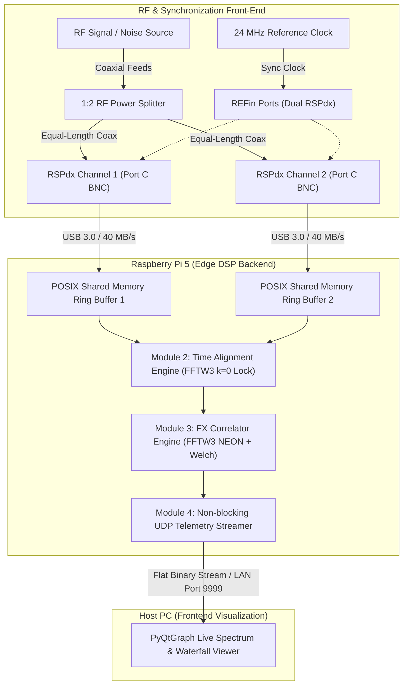

# Decametric Solar Radio Interferometer (30.0 – 40.0 MHz)

A real-time, dual-channel coherent radio interferometer designed for decametric solar radio burst observation (Solar Type II and Type III events). The system couples two SDRplay RSPdx software-defined radio receivers synchronized via an external 24 MHz reference clock to a Raspberry Pi 5 edge compute node running a multi-process C++17 FX correlator pipeline, streaming real-time visibilities via UDP to a host visualization workstation.

---

## 1. System Overview & Architecture

The instrumentation is structured across two physical nodes: an **Embedded Edge DSP Node** (Raspberry Pi 5) responsible for high-throughput USB 3.0 ingestion, sample-accurate alignment, and FX correlation; and a **Host Visualization Node** (PC) providing real-time GPU-accelerated waterfall rendering and scientific archiving.



---
## 2. Key Engineering Challenges & Design Rationale

Building a coherent radio interferometer with low-cost commercial SDRs presents fundamental physics and timing bottlenecks:

* **Eliminating Sampling Drift with 24 MHz Reference Locking:**  
  Independent on-board TCXOs exhibit fractional frequency offsets of a few Hz, causing continuous sample drift ($k = 0 \to \pm 1 \to \pm 2\dots$) within seconds. Distributing an external 24.0 MHz clock to both `REFin` ports forces identical ADC sampling rates ($f_{s1} = f_{s2}$), ensuring zero drift over extended observation runs.

* **Broadband Noise Standard for Multi-Tier Calibration:**  
  Rather than relying on single-tone CW signals—which introduce periodic phase ambiguity and low correlation contrast—the system integrates a broadband avalanche noise source as an absolute physical calibration standard. This hardware reference fulfills three critical calibration functions:
  1. *Coarse Delay Synchronization:* Exploits high random entropy across 10 MHz to compress cross-correlation into an isolated Dirac delta ($\delta[k]$), driving Peak-to-Noise Ratio (PNR) above 30 dB for deterministic $k=0$ sample locking.
  2. *Instrumental Phase & Gain Equalization:* Directly measures the static inter-channel transfer function $\Delta\phi_0(f)$ across all 2048 FFT bins, establishing the phase calibration matrix to neutralize internal analog filter and path discrepancies.
  3. *Radiometric Flux Scaling ($T_{\text{sys}}$):* Serves as a calibrated hot/cold standard for Y-factor measurements, mapping arbitrary ADC digital units to physical brightness temperature (Kelvin) and Solar Flux Units (SFU) while tracking receiver thermal gain drift.  
* **Multi-Process USB Jitter Elimination:**  
  API initialization jitter between separate child processes introduces up to $\sim 30\text{ ms}$ ($\sim 300,000\text{ samples}$ at 10 MSPS) of startup skew—far exceeding the $N = 65,536$ FFT snapshot window. A shared-memory barrier gate synchronizes the write-pointers at a common microsecond epoch prior to correlation.

## 3. Key Specifications

| Parameter | Specification | Notes / Verification Status |
| :--- | :--- | :--- |
| **RF Operating Band** | 30.0 – 40.0 MHz | Center frequency $f_{\text{LO}} = 35.0\text{ MHz}$ |
| **Analog IF Bandwidth** | 8.0 MHz analog filter | SDRplay `BW_8_000` configuration |
| **Sampling Rate ($f_s$)** | 10.0 MSPS complex I/Q | $100\text{ ns}$ sample period, sustaining 80 MB/s total USB throughput |
| **Clock Synchronization** | External 24.0 MHz reference clock | Common distribution to dual `REFin` ports, zero sample drift verified |
| **RF Input Port** | 2x Antenna Port C (50 $\Omega$ BNC) | Matched impedance, manual gain locked to 30 dB (IF AGC disabled) |
| **Inter-Process Buffer** | POSIX Shared Memory (`/dev/shm`) | Lock-free SPSC circular ring buffers ($2^{22}$ complex samples / 16.7 MB per channel) |
| **Coarse Time Alignment** | Fast cross-correlation via FFTW3 | Snapshot $N = 65,536$, startup delay resolved to $\vert{}k\vert{} \le 1\text{ sample}$ ($\approx 100\text{ ns}$) |
| **Spectral Engine (F-Engine)**| 2048-point 1D Complex FFT | Hanning-windowed, 50% overlap, ARM NEON SIMD accelerated via FFTW3 |
| **Cross-Engine (X-Engine)** | Cross-power $S_{12}(f) = X_1(f) X_2^*(f)$ | Autospectra $S_{11}, S_{22}$ computed concurrently for power normalization |
| **Time Integration ($\tau$)** | Welch vector accumulation ($\tau = 200\text{ ms}$) | Configurable $M = 1953$ to 2441 frames; output refresh rate $\sim 5\text{ FPS}$ |
| **Network Telemetry** | Flat binary UDP datagrams | Custom header + 2048 float32 array sent to port 9999 |

---

## 4. Documentation Map

Detailed technical documentation, mathematical derivations, schematics, and lab test reports are maintained in the [`docs/`](docs/) directory:

*   **Hardware & RF Front-End (`docs/01-hardware/`):**
    *   [RF Front-End & Antennas](docs/01-hardware/rf-frontend.md): Antenna geometry, coaxial impedance matching, and BNC Port C termination.
    *   [24 MHz Clock Distribution](docs/01-hardware/clock-sync.md): Reference oscillator splitting, phase locking, and `REFin` port distribution.
    *   [Avalanche Noise Source](docs/01-hardware/noise-source.md): 2N2222 B-E junction avalanche core, active current mirror biasing, MMIC buffer stage, 10 dB Pi-attenuator matching (-50 dBm output), and GPIO power gating.
    *   [RF Switching & Routing](docs/01-hardware/rf-switching.md): Dual SPDT switches (HMC544AE), symmetric 1:2 resistive Wye splitter, GPIO state control, and port isolation.
    *   [Host Interconnect & Power](docs/01-hardware/host-interconnect.md): Raspberry Pi 5 USB 3.0 throughput constraints, power budgeting, and isolation.

*   **Firmware & DSP Pipeline (`docs/02-firmware-dsp/`):**
    *   [IPC Architecture](docs/02-firmware-dsp/architecture.md): Multi-process `fork()` model, zero-copy POSIX shared memory, and lock-free atomic barriers.
    *   [Module 1 - SDR Ingestion Driver](docs/02-firmware-dsp/module1-driver.md): SDRplay API v3 integration and continuous 10 MSPS dual streaming.
    *   [Module 2 - Real-Time Time Alignment](docs/02-firmware-dsp/module2-time-align.md): Initial USB startup delay compensation, flush barriers, and sample-level locking ($k = 0$).
    *   [Module 3 - FX Correlator](docs/02-firmware-dsp/module3-fx-correlator.md): 50% overlap F-Engine, ARM NEON vectorization, Hanning power correction, and Welch integration.
    *   [Module 4 - UDP Telemetry & Viewer](docs/02-firmware-dsp/module4-telemetry.md): Binary socket protocol and GPU-accelerated PyQtGraph waterfall visualization.
*   **Verification & Calibration (`docs/03-calibration-tests/`):**
    *   [Zero-Baseline Lab Bench Verification](docs/03-calibration-tests/lab-bench-test.md): CW tone and wideband noise bench tests with peak-to-noise ratio analysis.
    *   [Debug Chronicles](docs/03-calibration-tests/debug-chronicles.md): Engineering logbook covering buffer wrap-around, race conditions, and synchronization fixes.
    *   [Field Deployment](docs/03-calibration-tests/field-deployment.md): Site noise surveys, antenna array erection, and observational campaigns.
*   **Deployment Guides (`docs/04-deployment-guide/`):**
    *   [Raspberry Pi 5 OS Setup](docs/04-deployment-guide/pi5-setup.md): Headless Linux tuning, CPU governor optimization, and driver installation.
    *   [Systemd Daemonization](docs/04-deployment-guide/systemd-daemon.md): Automated boot management, watchdog recovery, and operational scripts.

---

## 5. Project Status & Roadmap

### Current Status: Phase 1 — Lab Benchtop Instrumentation (Completed)
All hardware-level synchronization, real-time shared-memory pipelines, and DSP correlation modules have been validated on the test bench:
*   **Clock Phase Coherence:** External 24 MHz reference clock distribution verified across both RSPdx ADCs with zero relative sampling drift over 60-second continuous runs.
*   **Continuous Dual Ingestion:** Multi-process POSIX Shared Memory architecture sustains an aggregate 80 MB/s raw I/Q throughput with zero dropped buffers.
*   **Coarse Delay Alignment (Module 2):** Automated cross-correlation identifies non-deterministic USB startup offsets and drains buffer lead, locking synchronization to $\vert{}k\vert{} \le 1\text{ sample}$ ($\approx 100\text{ ns}$) with $\text{PNR} > 15\text{ dB}$.
*   **FX Correlation Core (Module 3):** Pre-allocated, zero-heap FFTW3 transformation with 50% overlap and Welch integration verified against synthetic and CW bench tones.
*   **Real-Time Telemetry & GUI (Module 4):** Non-blocking UDP transport with PyQtGraph displaying real-time power spectrum and dynamic waterfall spectrograms.

### Future Roadmap: Phase 2 — Field Deployment & Science Archiving
*   **Automated Calibration Switching:** Implement GPIO-driven RF switches to toggle between zero-baseline noise calibration and outdoor antennas.
*   **Antenna Field Array:** Deploy dual East-West baseline wire dipoles optimized for the 30.0 – 40.0 MHz decametric observation window.
*   **Fringe Stopping:** Implement continuous sub-sample geometric delay phase rotation ($e^{-j 2\pi f \tau_g(t)}$) in the F-Engine.
*   **HDF5 Archiving:** Integrate rolling daily storage of complex visibilities ($\text{Re}, \text{Im}, S_{11}, S_{22}$) in standard HDF5 format on the host workstation.
*   **Autonomous Station Automation:** Deploy systemd service watchdogs and automated nocturnal cloud backup via `rclone`.

---

## 6. Repository Structure

```text
solar_correlator/
├── CMakeLists.txt              # Top-level build configuration (C++17, -O3, NEON)
├── WORKFLOW.md                 # Dual-node Git synchronization guidelines
├── src/                        # Core backend DSP source code (runs on Pi 5)
│   ├── config.hpp              # Central system configuration and constants
│   ├── ring_buffer.hpp         # Lock-free SPSC POSIX Shared Memory ring buffer
│   ├── time_alignment.hpp/.cpp # Startup sample alignment and cross-correlation
│   ├── correlator.hpp/.cpp     # FX Correlator (F-Engine + X-Engine)
│   ├── telemetry_sender.hpp    # Non-blocking UDP socket streamer
│   └── main.cpp                # Multi-process supervisor and execution loop
├── tests/                      # Standalone hardware diagnostic binaries
│   ├── single_dev_test.cpp     # Individual RSPdx validation
│   ├── dual_stream_test.cpp    # Dual USB 10 MSPS continuous throughput test
│   └── alignment_test.cpp      # Standalone 60s sample alignment validation test
├── viewer/                     # Frontend visualization (runs on Host PC)
│   ├── viewer.py               # PyQtGraph live spectrum and waterfall display
│   └── requirements.txt        # Python dependencies (PyQt5, pyqtgraph, numpy)
└── docs/                       # Project engineering blog and documentation
    ├── index.md                # Documentation portal
    ├── 01-hardware/            # RF front-end, clock sync, and wiring schematics
    ├── 02-firmware-dsp/        # C++ DSP algorithms and IPC memory models
    ├── 03-calibration-tests/   # Bench test logs, PNR analysis, and field records
    ├── 04-deployment-guide/    # Headless Pi 5 Linux configuration and daemons
    └── assets/                 # Schematics, test plots, and bench setup photos
```

---

## 7. Quick Start Guide

### Prerequisites
*   **Raspberry Pi 5 Node:** Raspberry Pi OS 64-bit Lite, SDRplay API v3 driver service, FFTW3 (`libfftw3-dev`), CMake, GCC/G++ with C++17 support.
*   **Host PC Node:** Python 3.8+, `pyqt5`, `pyqtgraph`, `numpy`.

### 1. Build and Run Hardware Sanity Check (Raspberry Pi 5)
```bash
cd ~/solar_correlator
cmake -B build
cmake --build build -j4

# Restart the SDRplay service and verify dual-device sample lock
sudo systemctl restart sdrplay
./build/alignment_test
```

### 2. Launch Real-Time Correlator Backend (Raspberry Pi 5)
```bash
./build/solar_correlator
```

### 3. Launch Frontend Visualizer (Host PC)
```bash
# On your local machine (within the same LAN)
pip install -r viewer/requirements.txt
python viewer/viewer.py
```

---

## 7. License & Acknowledgments

This project is developed for educational and academic research in observational radio astronomy. Code and schematics are distributed under the MIT License. SDRplay API remains the intellectual property of SDRplay Ltd.