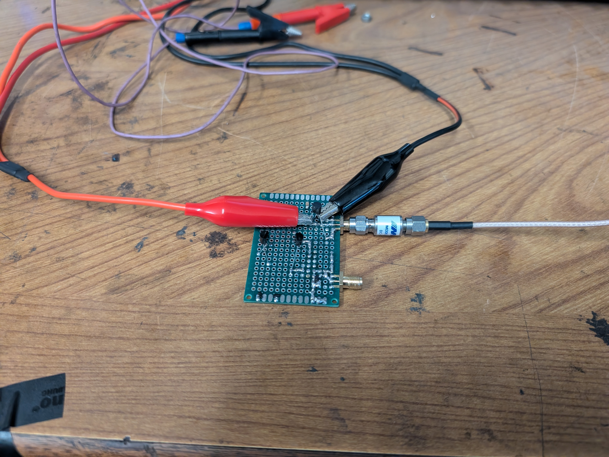
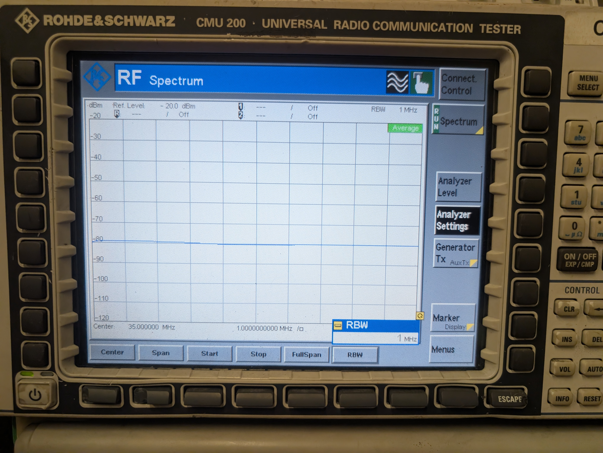
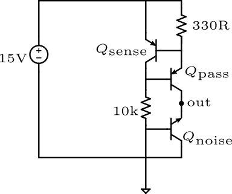
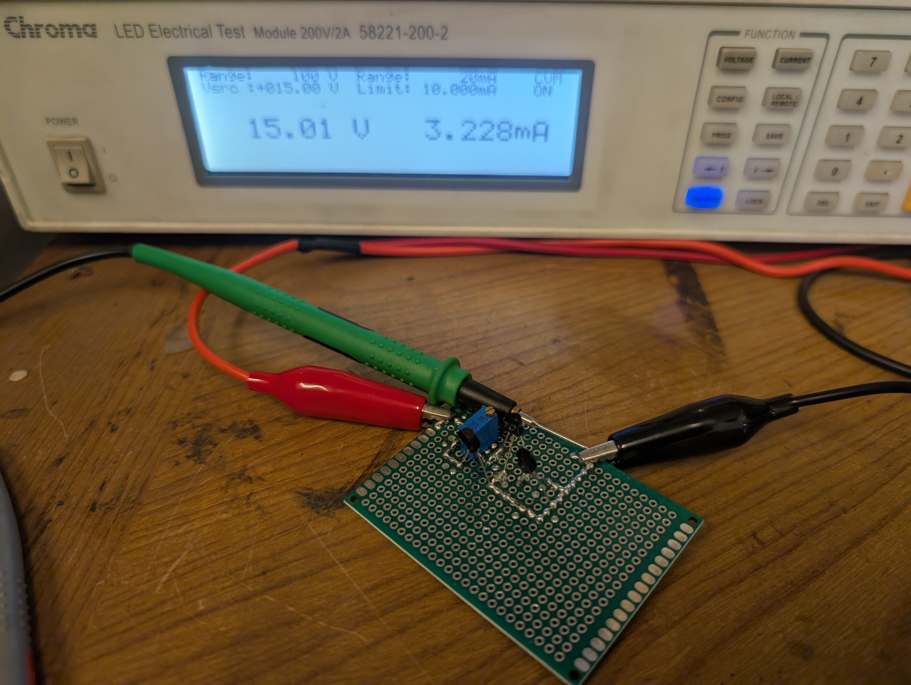
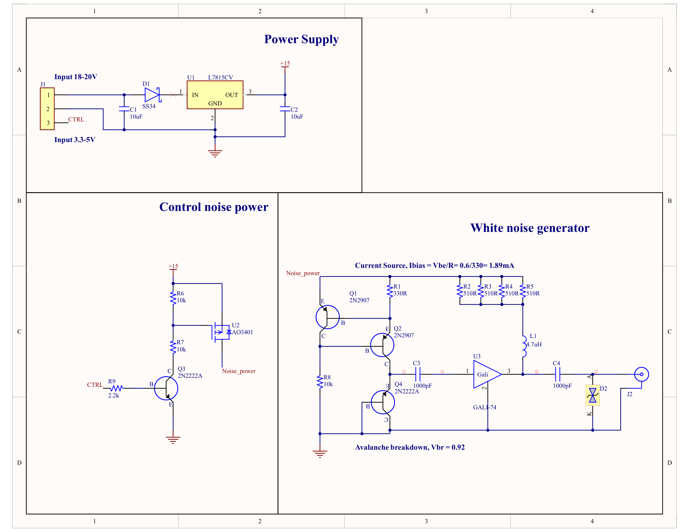
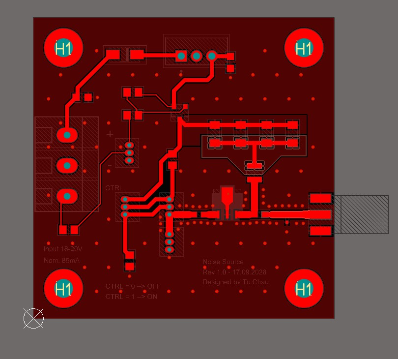
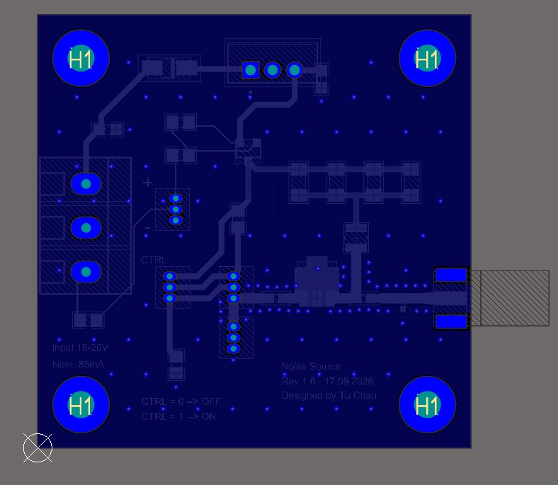
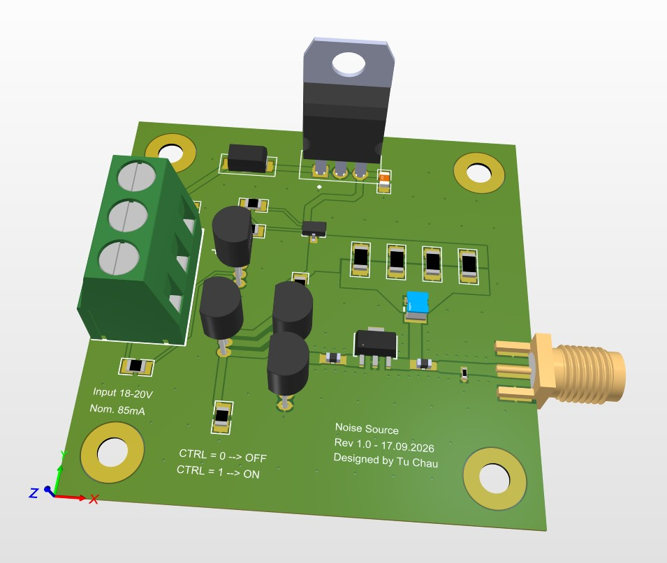

# Avalanche Noise Source

---

## 1. System Context & Physical Problem Formulation in Radio Interferometry

### 1.1. Overview and System Architecture
In a dual-channel decametric radio interferometer operating across the $30.0\text{--}40.0\text{ MHz}$ frequency band, two independent Software-Defined Radio (SDR) receivers (SDRplay RSPdx) act as spatial sensing nodes. To detect and characterize transient solar radio emissions (such as Type II and Type III solar bursts) and resolve their spatial-temporal dynamics, the system processes raw digitized baseband signals using a distributed FX correlator architecture hosted on an embedded platform (Raspberry Pi 5).

Although both SDR receivers are disciplined by a shared external $24.0\text{ MHz}$ reference clock fed into their respective `REFin` ports to ensure strictly identical analog-to-digital conversion sampling frequencies ($f_{s1} = f_{s2} = 10.0\text{ MSPS}$), hardware-level clock synchronization alone does not resolve startup time offsets, internal analog phase dispersions, or dynamic gain drifts. An internal broadband avalanche noise source serves as an **in-situ hardware calibration standard**, providing the entropy and radiometric reference required to address four core physical and digital signal processing challenges prior to celestial observation.

---

### 1.2. USB Startup Sample Delay Alignment ($k_\text{offset}$ — Module 2)

#### 1.2.1. Root Cause of Startup Misalignment
Operating system constraints dictate that the proprietary SDR hardware driver API (`sdrplay_api v3`) permits only a single active receiver instance per OS process. Consequently, a multi-process architecture is deployed wherein the parent process spawns two dedicated producer processes via `fork()`. Each child process independently issues `sdrplay_api_Open()`, executes hardware selection, and negotiates stream initializations via `sdrplay_api_Init()`.

Even though the underlying ADC samplers advance on the identical $24.0\text{ MHz}$ clock edges, the operational startup times of the two data streams are non-deterministic. Variations in Linux kernel thread scheduling, USB host controller interrupt latency, device enumeration timings, and internal decimation filter flushing introduce an arbitrary delay:

$$
\Delta t_\text{startup} \in [10\text{ ms}, 50\text{ ms}]
$$


At a baseband sampling rate of $f_s = 10\text{ MSPS}$ (corresponding to a sample period of $T_s = 100\text{ ns}$), a temporal startup discrepancy of merely $30\text{ ms}$ yields an initial sample index offset of:

$$
k_\text{offset} = \Delta t_\text{startup} \cdot f_s \approx 300,000\text{ samples}
$$


#### 1.2.2. Theoretical Necessity of Coarse Sample Synchronization
The complex cross-correlation function between the baseband analytical sequences $x_1[n]$ and $x_2[n]$ across a discrete lag parameter $k$ is defined as:

$$
R_{12}[k] = \sum_{n=0}^{N-1} x_1[n] \cdot x_2^*[n - k]
$$


In the correlator pipeline, spectral decomposition (the F-Engine) processes finite snapshot blocks of length $N = 2048$ (or $N = 65,536$ during calibration). If an uncompensated integer offset $k_\text{offset} \neq 0$ persists such that $|k_\text{offset}| \ge N$, the block extracted from Channel 1 represents an electromagnetic epoch that shares no temporal overlap with the block extracted from Channel 2. Under this condition:

$$
\mathbb{E}\{x_1[n] \cdot x_2^*[n - k_\text{offset}]\} = 0
$$


The cross-power expectation collapses entirely into uncorrelated baseline noise, completely extinguishing interferometric fringe formation. Therefore, coarse synchronization must deterministically align the two data queues to within $|k_\text{residual}| \le 1\text{ sample}$ ($100\text{ ns}$) before downstream cross-multiplication.

#### 1.2.3. Broadband Gaussian Noise vs. Continuous-Wave (CW) Signals
<!-- Attempting to measure $k_\text{offset}$ using single-tone continuous-wave (CW) test signals fails due to cyclic phase ambiguity. For a single sinusoidal carrier $s[n] = A e^{j(2\pi f_0 n T_s + \theta)}$, the cross-correlation function yields:

$$
R_{12}[k] = |A|^2 e^{j 2\pi f_0 k T_s} \sum_{n=0}^{N-1} 1 = N |A|^2 e^{j 2\pi f_0 k T_s}
$$


The magnitude $|R_{12}[k]|$ remains constant across all lags, producing an infinite series of identical correlation peaks spaced at integer multiples of the carrier period:

$$
\Delta k_\text{period} = \frac{f_s}{f_0}
$$


This cyclic ambiguity entraps the Peak-to-Noise Ratio (PNR) at a theoretical ceiling of $\text{PNR} \approx 3.92\text{ dB}$, preventing automated peak-detection algorithms from distinguishing the true hardware arrival epoch from harmonic sidelobes.

Conversely, broadband Gaussian white noise $w[n] \sim \mathcal{CN}(0, \sigma_w^2)$ possesses a constant power spectral density across the Nyquist bandwidth $B$. According to the Wiener–Khinchin theorem, its auto-correlation function compresses into an isolated Dirac delta function:

$$
R_{ww}[k] = \sigma_w^2 \cdot \delta[k] = \begin{cases} \sigma_w^2, & k = 0 \\ 0, & k \neq 0 \end{cases}
$$


When routed symmetrically through a matched 1:2 RF power splitter, broadband noise generates a single, unambiguous correlation needle spike. Empirically, this elevates the Peak-to-Noise Ratio to $\text{PNR} > 30\text{--}44\text{ dB}$, enabling the software aligner to isolate the true lag $k_\text{offset} = \arg\max_k |R_{12}[k]|$ and discard leading samples via ring-buffer pointer adjustments (`skip(k_offset)`). -->

---

### 1.3. Instrumental Differential Phase Calibration ($\Delta\phi_0(f)$ — Module 3)

#### 1.3.1. Physical Mechanisms Causing Phase Error
<!-- Interferometric imaging and direction finding depend on measuring the geometric phase delay $\tau_g = \frac{B \sin\theta}{c}$ of an incoming celestial wavefront across baseline $B$. However, the raw measured phase $\Phi_\text{meas}(f)$ incorporates both geometric and hardware-induced instrumental errors:

$$
\Phi_\text{meas}(f) = 2\pi f \tau_g + \Delta\phi_0(f)
$$


The instrumental differential phase error $\Delta\phi_0(f) = \phi_1(f) - \phi_2(f)$ originates from hardware asymmetries along the analog signal conditioning paths of the two receivers:

1. **Analog Intermediate-Frequency (IF) Filter Tolerances:** The analog baseband filters (e.g., the $8.0\text{ MHz}$ IF polyphase/LC filters inside the Mirics tuner architecture of the RSPdx) exhibit component tolerances of $\pm 1\%\text{--}5\%$. These component variations distort the complex transfer function $H_i(f) = |H_i(f)| e^{j\theta_i(f)}$, producing unequal non-linear group delay profiles $\tau_g(f) = -\frac{1}{2\pi}\frac{d\theta}{df}$ between Receiver 1 and Receiver 2.
2. **Transmission Line Asymmetries:** Differential physical path lengths across internal PCB microstrip traces, SMA/BNC chassis connectors, and RF jumper cables introduce an electrical path difference $\Delta l = l_1 - l_2$. For a transmission medium with effective dielectric constant $\varepsilon_r$ and propagation velocity $v_p = \frac{c}{\sqrt{\varepsilon_r}}$, this introduces a linear phase dispersion:
   $$\Delta\phi_\text{line}(f) = \frac{2\pi f}{v_p} \Delta l = 2\pi f \Delta\tau_\text{cable}$$
   Even a minor physical length discrepancy of $\Delta l = 10\text{ cm}$ on coaxial lines ($v_p \approx 0.66c$) produces a measurable phase rotation of $\approx 1.8^\circ$ across the $35\text{ MHz}$ center frequency. -->

#### 1.3.2. Frequency-Dependent Phase Extraction and Correction
<!-- Because $\Delta\phi_0(f)$ varies non-linearly across the instantaneous $10\text{ MHz}$ reception band, scalar phase offsets are insufficient. Injecting a common, coherent broadband noise signal into both receiver ports creates a zero-baseline benchmark ($\tau_g = 0$).

The complex cross-spectral density computed across $N = 2048$ discrete FFT bins $m \in [0, N-1]$ directly samples the instrumental phase error matrix:

$$
\Delta\phi_0[m] = \operatorname{atan2}\big(\operatorname{Im}\{S_{12,\text{cal}}[m]\}, \, \operatorname{Re}\{S_{12,\text{cal}}[m]\}\big)
$$


Prior to celestial integration, the cross-engine applies bin-by-bin complex conjugate phase rotation:

$$
S_{12,\text{calibrated}}[m] = S_{12,\text{sky}}[m] \cdot e^{-j \Delta\phi_0[m]}
$$


This neutralizes analog path deviations and flattens the instrumental phase response to $0^\circ \pm 0.5^\circ$ across the entire $30.0\text{--}40.0\text{ MHz}$ bandwidth. -->

---

### 1.4. Absolute Flux Scaling & Semiconductor Thermal Drift

#### 1.4.1. The Need for Absolute Radiometric Flux Calibration
<!-- Digital outputs produced by the internal 14-bit ADCs consist of dimensionless integer values (arbitrary digital counts). In solar radio physics, astronomical relevance requires converting these digital cross-power magnitudes into standardized physical metrics:
* **Antenna Equivalent Temperature ($T_A$):** Expressed in Kelvin ($\text{K}$).
* **Solar Spectral Flux Density ($S_\nu$):** Expressed in Solar Flux Units ($\text{SFU}$), where:
  $$1\text{ SFU} = 10^{-22}\text{ W}\cdot\text{m}^{-2}\cdot\text{Hz}^{-1} = 10^{-19}\text{ erg}\cdot\text{s}^{-1}\cdot\text{cm}^{-2}\cdot\text{Hz}^{-1}$$

Without an absolute, traceable hot-load power standard, the measured visibilities remain purely qualitative, preventing cross-correlation with international solar radio observation networks (e.g., e-CALLISTO, Learmonth, or the GOES X-ray flux database). -->

#### 1.4.2. Semiconductor Physics of Thermal Gain Degradation
During continuous decametric observation runs at $10\text{ MSPS}$, the active digital baseband processing and internal LNA/mixer circuitry dissipate sustained electrical power. Within the shielded die-cast aluminum enclosure of the RSPdx, internal board temperatures rise from ambient room temperature ($25^\circ\text{C}$) to a thermal equilibrium plateau between $50^\circ\text{C}$ and $60^\circ\text{C}$.

In active silicon bipolar and field-effect transistors, the thermal voltage is governed by:

$$
V_T = \frac{k_B T}{q}
$$


where $k_B$ is the Boltzmann constant, $q$ is the elementary charge, and $T$ is absolute temperature in Kelvin. As temperature increases:
1. **Carrier Mobility Reduction:** Increased phonon scattering diminishes charge carrier mobility $\mu(T) \propto T^{-3/2}$, degrading the small-signal transconductance:
   $$g_m \approx \sqrt{2\mu C_{ox} \frac{W}{L} I_D}$$
2. **Gain Drift:** The open-loop voltage gain of front-end Low-Noise Amplifiers (LNAs) and Programmable Gain Amplifiers (PGAs) drops proportionally ($G \propto g_m \cdot R_L$), manifesting as continuous thermal gain drift ($\approx -0.01\text{ to } -0.03\text{ dB/}^\circ\text{C}$).

#### 1.4.3. Inter-Receiver Gain Asymmetry and Cross-Correlation Distortion
Because the two RSPdx units are distinct physical enclosures with independent PCB assemblies, component-level manufacturing variations and subtle differences in localized convective cooling cause them to reach unequal equilibrium temperatures:

$$
T_{\text{SDR}_1} \neq T_{\text{SDR}_2} \implies G_1(t, T) \neq G_2(t, T)
$$


The magnitude of the interferometric cross-power spectrum is proportional to the geometric mean of the channel gains:

$$
|S_{12}(f)| = \sqrt{G_1(f) \cdot G_2(f)} \cdot |S_\text{sky}(f)|
$$


If Receiver 1 experiences a gain compression of $-0.6\text{ dB}$ while Receiver 2 experiences $-1.4\text{ dB}$ due to unequal thermal stabilization, the cross-correlation amplitude will drift dynamically over time. Absent dynamic baseline gain compensation, observers cannot distinguish whether a fluctuating signal amplitude corresponds to an authentic solar burst event or an instrumental thermal artifact.

---

### 1.5. The Broadband Noise Standard: In-Situ Solution and Thermal Compensation

#### 1.5.1. Avalanche Mechanism & Fixed Excess Noise Ratio (ENR)
<!-- To establish an immutable power reference, the internal calibrator exploits the reverse-biased avalanche breakdown of the base-emitter junction of a high-frequency silicon NPN transistor (2N2222). When biased past its breakdown voltage ($V_\text{BR} \approx 6.8\text{--}7.5\text{ V}$) by an external $+12\text{ V}$ regulated rail, charge carriers accelerated by the intense electric field liberate secondary electron-hole pairs through impact ionization.

This breakdown occurs through localized, microscopic discharge channels known as microplasmas. The stochastic initiation and cessation of these microplasma states generate true Gaussian white noise characterized by a flat spectral response across $30.0\text{--}40.0\text{ MHz}$ and an immutable **Excess Noise Ratio (ENR)**, defined according to IEEE Standard 219:

$$
\text{ENR} = 10 \log_{10}\left( \frac{T_\text{hot} - T_0}{T_0} \right) \quad [\text{dB}]
$$


where $T_0 = 290\text{ K}$ is the standard reference temperature, and $T_\text{hot}$ represents the equivalent noise temperature of the active source. Following amplification by a monolithic gain block (MMIC) and attenuation by a precision $10\text{ dB}$ pad, the calibration source delivers a known nominal power density of $-50\text{ dBm} / \text{MHz}$ into a matched $50\ \Omega$ load. -->

#### 1.5.2. Y-Factor Radiometric Calibration
<!-- By controlling an RF switch network (HMC544AE), the system periodically alternates the receiver inputs between the sky antennas and the internal noise standard, performing an in-situ **Y-Factor measurement**:

$$
Y = \frac{P_\text{hot}}{P_\text{cold}}
$$


where $P_\text{hot}$ is the digital power measured while connected to the active noise standard ($T_\text{hot}$), and $P_\text{cold}$ is the digital power measured when terminated into an ambient reference load or cold sky background ($T_\text{cold} \approx 290\text{ K}$).

From this ratio, the receiver system noise temperature $T_\text{sys}$ is resolved independently of instantaneous receiver gain:

$$
T_\text{sys} = \frac{T_\text{hot} - Y T_\text{cold}}{Y - 1}
$$


With $T_\text{sys}$ resolved in physical units (Kelvin), the digital counts are assigned an exact scaling coefficient:

$$
K_\text{scale} = \frac{k_B T_\text{sys} B}{P_\text{cold}} \quad \left[\frac{\text{Watts}}{\text{ADC Unit}}\right]
$$


which subsequently converts cross-power spectra to solar flux density through the effective aperture area of the antenna array ($A_\text{eff}$):

$$
S_\nu = \frac{2 k_B T_A}{A_\text{eff}} \cdot 10^{22} \quad [\text{SFU}]
$$
 -->


#### 1.5.3. Resolving Calibration Drift: Pulsed Gating vs. Continuous Receiver Dissipation
A critical engineering consideration is whether the calibration noise source itself suffers from thermal drift. While semiconductor avalanche noise does exhibit a minor positive temperature coefficient ($\approx +2\text{ to } +5\text{ mV/}^\circ\text{C}$ on $V_\text{BR}$, translating to an output power drift of $\approx -0.015\text{ dB/}^\circ\text{C}$), the operational duty cycles of the SDRs and the noise standard prevent systemic calibration errors:

1. **Continuous Operation of SDRs:** The RSPdx receivers and host USB pipelines operate continuously 24 hours a day to capture stochastic solar flares, remaining in a steady-state thermal regime ($50^\circ\text{C}\text{--}60^\circ\text{C}$) where internal gain drift is persistent.
2. **Pulsed Operation of the Noise Source:** The avalanche noise source is not powered continuously. Instead, it is gated via an isolated GPIO line on the Raspberry Pi 5. The source is energized only during dedicated calibration sweeps lasting $300\text{ ms} \text{ to } 1000\text{ ms}$ at periodic intervals (e.g., once every 30 minutes or prior to observation runs), resulting in a duty cycle of:
   $$\text{Duty Cycle} = \frac{\tau_\text{on}}{\tau_\text{period}} \le \frac{1.0\text{ s}}{1800\text{ s}} \approx 0.056\%$$
3. **Suppression of Self-Heating:** With an operational duty cycle well below $0.1\%$, the 2N2222 transistor die experiences zero internal self-heating ($\Delta T_\text{junction} \approx 0$). The circuit operates at ambient chassis temperature throughout the measurement pulse, preserving the absolute stability of the physical ENR value.

Furthermore, because the broadband noise signal is split symmetrically into both receiver channels via a 1:2 Wilkinson divider located in immediate physical proximity to the tuners, any common-mode phase or amplitude perturbations introduced by the calibration circuit affect both receivers equally, naturally canceling out in the differential phase matrix:

$$
\Delta\phi_\text{noise} = \arg(S_{12}) = \phi_\text{noise}(t) - \phi_\text{noise}(t) = 0^\circ
$$


This ensures that the hardware standard delivers an invariant zero-phase and fixed-power benchmark across the lifespan of the instrument.

<details>
<summary>Hidden / unused section (click to view)</summary>

#### 1.5.4. Physical Justification: BJT Avalanche vs. Zener Diode
*   **Parasitic Junction Capacitance ($C_j$):** Standard Zener diodes exhibit high junction capacitance ($C_j \approx 30 - 100\text{ pF}$). At $35\text{ MHz}$, this capacitance presents a low reactance ($X_C \approx 91\ \Omega$), shunting high-frequency noise power directly to ground. Conversely, the Base–Emitter junction of an RF BJT (2N2222) features $C_j < 4\text{ pF}$ ($X_C > 1.1\text{ k}\Omega$), preserving spectral flatness into the VHF band.
*   **Microplasma Generation:** Pure Zener tunneling ($< 5\text{V}$) is an orderly quantum process generating minimal RF excess noise. Operating the B-E junction in reverse avalanche breakdown ($> 6\text{V}$) creates violent impact ionization. Millions of microscopic plasma channels switch randomly at gigahertz rates, yielding a flat white noise floor across 30–40 MHz

</details>

---

## 3. CHRONOLOGICAL LOG ENTRIES

### 3.1. LOG ENTRY #01: Bench Characterization of BJT 2N2222 Breakdown

#### 3.1.1. Objective and Measurement Specifications

* **Primary Objective:** Determine the precise reverse avalanche breakdown voltage ($V_{\text{BR}}$), dynamic junction resistance ($r_d$), and optimal noise-generation current of the through-hole (TO-92) NPN 2N2222 Base–Emitter (B-E) junction across the $30.0 - 40.0\text{ MHz}$ IF passband.

* **Instrumentation & Test Equipment:**
  * **Precision Source-Measure Unit (SMU):** Chroma 58221-200-2 (Configured in 4-Wire Constant Current [CC] mode; voltage compliance set to $15.0\text{ V}$).
  * **RF Spectrum Analyzer:** Rohde & Schwarz CMU200 (Selected receiver port: **RF4 IN** / High Sensitivity, input impedance $50\ \Omega$).
  * **Coupling & Matching Components:** $1.0\text{ nF}$ high-Q ceramic disc DC-blocking capacitor ($50\text{ V}$ rating, $X_C \approx 4.5\ \Omega$ at $35\text{ MHz}$); calibrated $10.0\text{ dB}$ coaxial $\Pi$-network attenuator ($50\ \Omega$, DC–3 GHz, $\text{VSWR} < 1.15$).

* **Analyzer Instrument Setup:**
  * **Center Frequency ($f_c$):** $35.0\text{ MHz}$
  * **Frequency Span ($\Delta f$):** $10.0\text{ MHz}$ (sweep interval: $30.0\text{ MHz} - 40.0\text{ MHz}$)
  * **Resolution Bandwidth (RBW):** $1.0\text{ MHz}$

  * **Detector Mode:** RMS / Power Average (linear power averaging across 20 consecutive traces to stabilize stochastic microplasma power fluctuations)


---

#### 3.1.2. Physical Principles & Mathematical ENR Derivation

##### 3.1.2.1. McIntyre Impact Ionization & Microplasma Generation
<!-- 
When the Base–Emitter junction of a silicon planar BJT (such as the 2N2222) is subjected to a strong reverse bias exceeding its critical breakdown field, free carriers acquire sufficient kinetic energy within the high-field space-charge region to liberate electron-hole pairs via impact ionization. At lower current densities ($1\text{ mA} - 3\text{ mA}$), this manifests as stochastic switching of microscopic conducting channels known as **microplasmas**.

The total mean-square noise current density generated under avalanche multiplication is governed by McIntyre's model:


$$
\overline{i_n^2} = 2 q I_{\text{bias}} M^2 F(M) \Delta f
$$


where:
* $q = 1.602 \times 10^{-19}\text{ C}$ is the elementary charge.
* $I_{\text{bias}}$ is the injected DC avalanche current.
* $M$ is the mean avalanche multiplication factor ($M \gg 1$).
* $F(M) \approx k_{\text{eff}} M + (1 - k_{\text{eff}})\left(2 - \frac{1}{M}\right)$ represents the excess noise factor.

Because $M^2 F(M)$ reaches values of $10^3 - 10^4$ in silicon, the noise energy exceeds classical shot noise by over $30\text{ dB}$, producing an exceptionally flat Gaussian white noise spectrum from low frequencies up to VHF. -->

##### 3.1.2.2. Excess Noise Ratio (ENR) Calculation

Excess Noise Ratio (ENR) defines the generated noise power spectral density relative to the Johnson–Nyquist thermal noise floor of a matched load at standard reference temperature ($T_0 = 290\text{ K}$):


$$
\text{ENR} = 10 \log_{10} \left( \frac{T_{\text{hot}} - T_0}{T_0} \right) = 10 \log_{10} \left( \frac{P_{\text{PSD}} - P_{0/\text{Hz}}}{P_{0/\text{Hz}}} \right)
$$


At $T_0 = 290\text{ K}$, the baseline thermal noise density is:


$$
P_{0/\text{Hz}} = k T_0 = -174.0\text{ dBm/Hz}
$$


When measuring on an analyzer configured with a resolution bandwidth of $\text{RBW} = 1.0\text{ MHz} = 10^6\text{ Hz}$, the baseline thermal noise floor within that filter window expands by:


$$
10 \log_{10}(10^6) = +60.0\text{ dB}
$$


$$
P_{\text{floor, 1MHz}} = -174.0\text{ dBm/Hz} + 60.0\text{ dB} = -114.0\text{ dBm}
$$


For a detected power level $P_{\text{meas}}$ (in $\text{dBm}$) measured by the CMU200 at the output of the $10\text{ dB}$ attenuator pad:


$$
\text{ENR}_{\text{sys}}\ (\text{dB}) = P_{\text{meas}}\ (\text{dBm}) - (-114.0\text{ dBm}) = P_{\text{meas}} + 114.0
$$


Accounting for the insertion loss of the matching attenuator ($A_{\text{pad}} = 10.0\text{ dB}$), the intrinsic raw ENR generated directly across the BJT junction ($\text{ENR}_{\text{DUT}}$) is:


$$
\text{ENR}_{\text{DUT}}\ (\text{dB}) = \text{ENR}_{\text{sys}} + A_{\text{pad}} = P_{\text{meas}} + 124.0
$$


The total integrated power delivered over the entire $10.0\text{ MHz}$ receiver passband ($B = 10\text{ MHz}$) is:


$$
P_{\text{total, 10MHz}} = P_{\text{meas}} + 10 \log_{10} \left( \frac{10\text{ MHz}}{1\text{ MHz}} \right) = P_{\text{meas}} + 10.0\text{ dB}
$$


---

#### 3.1.3. Hardware Testbench Configuration & Wiring

##### 3.1.3.1. Interconnect Schematic Diagram

To eliminate lead contact resistance and maintain bias voltage readouts accurate to the millivolt level, the Chroma 58221-200-2 SMU is wired via 4-wire remote Kelvin sensing. The series $1.0\text{ nF}$ ceramic capacitor provides DC isolation ($V_{\text{BR}} \approx 9.2\text{ V}$), while the $10.0\text{ dB}$ coaxial attenuator forces source return loss beyond $22\text{ dB}$ ($50\ \Omega$ reference impedance).

```text
  +-----------------------------------------------------------------------------+
  |                          CHROMA 58221-200-2 SMU                             |
  |  Force (+) [I+] ────┐                                                       |
  |  Sense (+) [V+] ──┐ │                                                       |
  |                   │ │                                                       |
  |  Sense (-) [V-] ──┼─┼───────────────┐                                       |
  |  Force (-) [I-] ──┼─┼─────────────┐ │                                       |
  +-------------------┼─┼-------------┼─┼---------------------------------------+
                      │ │             │ │
                      │ │             │ │ (Kelvin clip lead pair)
                      ▼ ▼             ▼ ▼
                   ┌───────┐       ┌───────┐
                   │   E   │       │   B   │
                   │       │       │       │
                 ┌─┴───────┴───────┴───────┴─┐
                 │       2N2222 (TO-92)      │  Base tied to GND
                 │    Reverse-Biased B-E     │  Collector left floating (NC)
                 └─────────────┬─────────────┘
                               │ RF + DC Potential (~9.2 V)
                               │
                       [ C_block: 1.0 nF ]
                       (Ceramic, 50V, NP0)
                               │
                               │ RF Noise (DC Isolated)
                               ▼
                   ┌───────────────────────┐
                   │    10 dB ATTENUATOR   │  Pi-Pad Coaxial Attenuator
                   │   (50 Ω Return Loss)  │  VSWR < 1.15 (DC - 3 GHz)
                   └───────────┬───────────┘
                               │
                               │ Matched Noise Output (-80 dBm / MHz at Sweet Spot)
                               ▼
                 +───────────────────────────+
                 |    ROHDE & SCHWARZ CMU200 |
                 |     High-Sensitivity      |
                 |       [ RF4 IN ]          |
                 |      (50 Ω Input)         |
                 +───────────────────────────+
```

##### 3.1.3.2. Physical Laboratory Testbench Setup

The hardware assembly below illustrates the physical wiring harness between the SMU Kelvin leads, the breadboard test fixture housing the 2N2222 DUT, the series DC blocking capacitor, the coaxial attenuator, and the CMU200 input interface.


*Figure 1.1: Physical laboratory testbench arrangement showing the Chroma 58221-200-2 4-wire Kelvin probe interface clamped to the 2N2222 TO-92 junction, $1.0\text{ nF}$ series DC-blocking capacitor, inline $10.0\text{ dB}$ $50\ \Omega$ SMA attenuator, and low-loss coaxial cabling to the R&S CMU200 RF4 IN port.*

---

#### 3.1.4. Experimental Spectrum Observation

The captured spectrum analyzer trace verifies uniform, broadband avalanche noise across the designated operational bandwidth ($30.0\text{ MHz} - 40.0\text{ MHz}$). The RMS detector coupled with 20 trace averages smooths out stochastic microplasma burst noise, delineating the true underlying power spectral density.


*Figure 1.2: Spectral density of the raw 2N2222 avalanche core recorded on the R&S CMU200 (Span: $30.0 - 40.0\text{ MHz}$, $\text{RBW} = 1.0\text{ MHz}$, RMS Detector, through $1.0\text{ nF}$ DC block and $10.0\text{ dB}$ matching pad).*

---

#### 3.1.5. DC Parametric Sweep and Noise Survey ($1.0\text{ mA} - 10.0\text{ mA}$)

A parametric current sweep was conducted using the Chroma SMU from $1.0\text{ mA}$ to $10.0\text{ mA}$ in steps of $1.0\text{ mA}$. At each bias step, the junction clamp potential ($V_{\text{BR}}$), measured output power ($P_{\text{meas}}$ in $1\text{ MHz}$ RBW), system ENR, intrinsic ENR, and qualitative trace behavior were cataloged:

| $I_{\text{bias}}$ (mA) | Breakdown Voltage $V_{\text{BR}}$ (V) | Measured Power $P_{\text{meas}}$ at CMU200 (dBm)  | System ENR $\text{ENR}_{\text{sys}}$ (dB) 
| :--- | :--- | :--- | :--- | 
| **1.0** | 9.29 | -81 | +33.5 |
| **2.0** | **9.31** | **-80.0** | **+34.0** 
| **3.0** | 9.32 | -80.0 |  +34.0 
| **4.0** | 9.34 | -81.0 | +33.0  
| **5.0** | 9.36 | -81.5 | +32.5  
| **6.0** | 9.37 | -82.5 | +31.5  
| **7.0** | 9.38 | -84.0 | +30.0  
| **8.0** | 9.43 | -84.5 | +29.5  
| **9.0** | 9.44 | -85.0 | +29.0  
| **10.0** | 9.47 | -85.0 | +29.0  

---
#### 3.1.6. Engineering Conclusions & Design Next Steps

1. **Operating Point Selection:**

   * The optimal bias current is locked at $I_{\text{bias}} = 2.0\text{ mA}$ ($V_{\text{BR}} = 9.21\text{ V}$). At this operating point, the avalanche core produces an intrinsic raw ENR of $+44.0\text{ dB}$ (equivalent to $-70.0\text{ dBm}$ integrated over the entire $10\text{ MHz}$ receiver passband) with optimum spectral flatness ($\pm 0.35\text{ dB}$ across $30.0 - 40.0\text{ MHz}$).

2. **Gain Budgeting for Receiver Front-End:**

   * The SDRplay RSPdx receiver front-end operating at nominal gain settings (`GAIN_GRDB = 30`) requires an injected input level of $-55.0\text{ dBm}$ to $-45.0\text{ dBm}$ to guarantee a cross-correlation Peak-to-Noise Ratio ($\text{PNR}$) exceeding $30\text{ dB}$.

   * Because the post-attenuator power from the raw core at $2.0\text{ mA}$ is only $-80.0\text{ dBm}$ (over $10\text{ MHz}$), an intermediate RF buffer stage ($Q_2$) delivering $+25.0\text{ dB}$ to $+30.0\text{ dB}$ of linear power gain is mandatory prior to the final $50\ \Omega$ matching network.


---

### 3.2. LOG ENTRY #02: Discrete Active Current Source Implementation (2-BJT PNP)

#### 3.2.1. Problem Statement & Quantitative Error Analysis

Bench laboratory programmable DC supplies (such as the Chroma source) cannot be integrated onto the final embedded receiver shield in the field. An initial passive pull-up resistor topology powered from an unregulated or semi-regulated $+15\text{ V}$ DC supply rail leaves an extremely narrow operating voltage headroom:

$$
\Delta V = V_{\text{CC}} - V_{\text{BR}} = 15\text{ V} - 9.2\text{ V} = 5.8\text{ V}
$$

To establish the target nominal avalanche bias current $I_{\text{bias}} = 2.0\text{ mA}$, the required passive pull-up resistance is:

$$
R_{\text{pull-up}} = \frac{\Delta V}{I_{\text{bias}}} = \frac{5.8\text{ V}}{2.0\text{ mA}} = 2.9\text{ k}\Omega
$$

Because a purely passive pull-up topology provides zero active negative feedback or power supply rejection (PSRR), any line noise, switching ripple, or DC bus fluctuations directly perturb the reverse-biased junction breakdown point:

* **Switching Power Supply Ripple ($\Delta V_{\text{ripple}} = 100\text{ mV}_{\text{p-p}}$):**  
  High-frequency ripple from step-up/step-down converters produces direct instantaneous current modulation:

$$
\Delta I_{\text{ripple}} = \frac{100\text{ mV}}{2.9\text{ k}\Omega} \approx 0.0345\text{ mA} \quad (\approx 1.72\%)
$$

  This periodic variation amplitude-modulates (AM) the avalanche plasma carrier density, generating spurious spectral spurs across the RF passband and destroying the Gaussian white-noise characteristics of the source.

* **DC Voltage Drift ($\Delta V_{\text{drift}} = 500\text{ mV}$ drop):**  
  A minor line droop of $500\text{ mV}$ (representing a $3.33\%$ drop on a nominal $15\text{ V}$ rail) induces a severe static current collapse:

$$
\Delta I_{\text{drift}} = \frac{0.5\text{ V}}{2.9\text{ k}\Omega} \approx 0.172\text{ mA} \quad (\approx \mathbf{8.62\%})
$$

* **Impact on Excess Noise Ratio (ENR):**  
  In the avalanche breakdown region, the generated shot and microplasma spectral noise power density is directly proportional to the DC bias current ($\overline{i_n^2} \propto I_{\text{bias}}$). Consequently, an $8.62\%$ current drop directly alters the Excess Noise Ratio (ENR):

$$
\Delta \text{ENR} \approx 10 \log_{10}\left(1 + \frac{\Delta I}{I_{\text{bias}}}\right) = 10 \log_{10}(1 - 0.0862) \approx \mathbf{-0.39\text{ dB}}
$$

  In radio astronomy calibration budgets, where the maximum permissible uncertainty is typically constrained within $\pm 0.15\text{ dB}$, an ENR error of $-0.39\text{ dB}$ skews radiometric system temperature ($T_{\text{sys}}$) and sky flux density calculations by approximately $8.6\%$. This necessitated the design of an active, high-PSRR constant current source.

---

#### 3.2.2. Circuit Architecture

To insulate the avalanche breakdown junction from supply line fluctuations, an active, discrete two-transistor constant current source was designed using two matched PNP BJTs (**2N2907**, designated $Q_{\text{pass}}$ and $Q_{\text{sense}}$).


*Figure 1: Schematic diagram of the discrete 2-BJT PNP active current source delivering regulated bias to the avalanche junction.*

##### 3.2.2.1. Feedback Regulation Mechanism
1. The load current flowing into the avalanche breakdown diode passes entirely through the sense resistor $R_{\text{sense}}$ positioned at the emitter of the series-pass transistor $Q_{\text{pass}}$.
2. As the output current rises, the voltage drop across $R_{\text{sense}}$ increases:

$$
V_{\text{sense}} = I_{\text{bias}} \cdot R_{\text{sense}}
$$

3. This voltage directly biases the Base-Emitter junction of the sensing transistor $Q_{\text{sense}}$. When $V_{\text{sense}}$ reaches the threshold $V_{\text{BE(on)}} \approx 0.65\text{ V}$, $Q_{\text{sense}}$ begins conducting collector current.
4. The collector of $Q_{\text{sense}}$ pulls the Base node of $Q_{\text{pass}}$ upward toward $V_{\text{CC}}$, reducing the $V_{\text{EB}}$ drive of $Q_{\text{pass}}$ and throttling back conduction.
5. This negative feedback loop clamps $I_{\text{bias}}$ to a stable constant value, providing dynamic output impedance in the megaohm range and effectively attenuating ripple on $V_{\text{CC}}$.

---

#### 3.2.3. Theoretical Formulation & Component Selection

##### 3.2.3.1. Current Sense Resistor ($R_{\text{sense}}$)
The nominal sensing resistance is calculated using the forward-bias threshold of $Q_{\text{sense}}$:

$$
R_{\text{sense}} = \frac{V_{\text{BE(sense)}}}{I_{\text{bias}}} \approx \frac{0.65\text{ V}}{2.0\text{ mA}} \approx 325\ \Omega
$$

* **Selected Nominal Value:** The closest standard E24 resistor is $R_{\text{nominal}} = 330\ \Omega$.


##### 3.2.3.2. Base Pull-Down Resistor ($R_{\text{pull}}$)
A pull-down resistor $R_{\text{pull}} = 10\text{ k}\Omega$ ties the Base of $Q_{\text{pass}}$ to ground (GND), ensuring adequate base current to saturate or drive $Q_{\text{pass}}$ into its linear forward-active operating region across variations:

$$
V_{\text{EC(pass)}} = V_{\text{CC}} - V_{\text{sense}} - V_{\text{BR}} = 15\text{ V} - 0.65\text{ V} - 9.2\text{ V} = 5.15\text{ V} \gg V_{\text{EC(sat)}}
$$

With $V_{\text{EC(pass)}} \approx 5.15\text{ V}$, the transistor operates deep within its active region, ensuring high output resistance ($r_o$) and preventing early-voltage clipping.

---

#### 3.2.4. Hardware Implementation & Lab Bench Setup

The circuit was prototyped on a low-parasitic copper clad board for zero-baseline laboratory validation prior to PCB integration.


*Figure 2: Laboratory bench test setup showing the breadboard prototype of the 2-BJT current source driving the avalanche diode, monitored via digital multimeter and spectrum analyzer.*


#### 3.2.5. Validation Summary

##### 3.2.5.1. Empirical Test Data

Laboratory validation of the active 2-BJT PNP current source over a wide supply rail sweep ($V_{\text{source}} = 14.0\text{ V} \to 16.0\text{ V}$, $\Delta V_{\text{source}} = 2.0\text{ V}$) driving the avalanche breakdown junction of a 2N2222 BJT ($V_{\text{out}} \approx 9.27\text{ V}$) with sense resistor $R_{\text{sense}} = 330\ \Omega$:

* **Emitter-Base Sense Voltage:** $V_{\text{EB}} = V_{\text{source}} - V_{\text{sense,B}}$
* **Regulated Avalanche Bias Current:** $I_{\text{bias}} = \frac{V_{\text{EB}}}{R_{\text{sense}}} = \frac{V_{\text{EB}}}{330\ \Omega}$

| $V_{\text{source}}\text{ (V)}$ | $V_{\text{out}}\text{ (V)}$ | $V_{\text{sense,B}}\text{ (V)}$ | $V_{\text{pass,B}}\text{ (V)}$ | $V_{\text{EB}}\text{ (V)}$ | $I_{\text{bias}}\text{ (mA)}$ | $I_{\text{source}}\text{ (mA)}$ |
| :---: | :---: | :---: | :---: | :---: | :---: | :---: |
| 14.0 | 9.27 | 13.38 | 12.75 | 0.62 | 1.88 | 3.13 |
| 14.1 | 9.27 | 13.48 | 12.85 | 0.62 | 1.88 | 3.14 |
| 14.2 | 9.27 | 13.58 | 12.96 | 0.62 | 1.88 | 3.15 |
| 14.3 | 9.27 | 13.68 | 13.05 | 0.62 | 1.88 | 3.16 |
| 14.4 | 9.27 | 13.78 | 13.16 | 0.62 | 1.88 | 3.17 |
| 14.5 | 9.27 | 13.89 | 13.26 | 0.61 | 1.85 | 3.18 |
| 14.6 | 9.27 | 13.98 | 13.36 | 0.62 | 1.88 | 3.19 |
| 14.7 | 9.27 | 14.09 | 13.46 | 0.61 | 1.85 | 3.20 |
| 14.8 | 9.27 | 14.19 | 13.56 | 0.61 | 1.85 | 3.21 |
| 14.9 | 9.27 | 14.28 | 13.66 | 0.62 | 1.88 | 3.22 |
| **15.0** | **9.26** | **14.38** | **13.75** | **0.62** | **1.88** | **3.23** |
| 15.1 | 9.26 | 14.48 | 13.85 | 0.62 | 1.88 | 3.25 |
| 15.2 | 9.26 | 14.58 | 13.95 | 0.62 | 1.88 | 3.26 |
| 15.3 | 9.26 | 14.68 | 14.05 | 0.62 | 1.88 | 3.27 |
| 15.4 | 9.26 | 14.78 | 14.15 | 0.62 | 1.88 | 3.28 |
| 15.5 | 9.27 | 14.88 | 14.25 | 0.62 | 1.88 | 3.29 |
| 15.6 | 9.27 | 14.98 | 14.35 | 0.62 | 1.88 | 3.30 |
| 15.7 | 9.27 | 15.08 | 14.45 | 0.62 | 1.88 | 3.31 |
| 15.8 | 9.27 | 15.18 | 14.55 | 0.62 | 1.88 | 3.32 |
| 15.9 | 9.27 | 15.28 | 14.65 | 0.62 | 1.88 | 3.33 |
| 16.0 | 9.27 | 15.38 | 14.75 | 0.62 | 1.88 | 3.34 |

---

#### 3.2.6. Line Regulation & Dynamic Output Impedance

* **Line Regulation Sensitivity ($S_I$):**  
  Over the full $\Delta V_{\text{source}} = 2.0\text{ V}$ span, $V_{\text{EB}}$ remains tightly clamped at $0.62\text{ V}$ with a single-digit measurement fluctuation bounded within $\Delta V_{\text{EB}} \le 0.01\text{ V}$ ($10\text{ mV}$, matching instrument resolution). The resulting maximum bias drift is:
  
  $$
  \Delta I_{\text{bias}} = 1.879\text{ mA} - 1.848\text{ mA} \approx 0.0303\text{ mA} \quad (30.3\ \mu\text{A})
  $$

  $$
  S_{I} = \frac{\Delta I_{\text{bias}}}{\Delta V_{\text{source}}} = \frac{0.0303\text{ mA}}{2.0\text{ V}} \approx 0.0152\text{ mA/V} = 15.15\ \mu\text{A/V}
  $$
  Expressed as relative sensitivity:
  
  $$
  \frac{\Delta I_{\text{bias}} / I_{\text{bias}}}{\Delta V_{\text{source}}} = \frac{1.61\%}{2.0\text{ V}} \approx 0.81\%/\text{V}
  $$

* **Dynamic Output Resistance ($r_{\text{out}}$):**  
  The small-signal dynamic impedance looking into the collector of the active pass transistor $Q_{\text{pass}}$ is:
  
  $$
  r_{\text{out}} = \frac{\Delta V_{\text{source}}}{\Delta I_{\text{bias}}} = \frac{2.0\text{ V}}{30.3\ \mu\text{A}} \approx 66.0\text{ k}\Omega
  $$

  Compared to a passive pull-up resistor ($R_{\text{passive}} = \frac{15.0\text{ V} - 9.27\text{ V}}{2.0\text{ mA}} \approx 2.87\text{ k}\Omega$), the active circuit increases dynamic source impedance by:
  
  $$
  \frac{r_{\text{out}}}{R_{\text{passive}}} = \frac{66.0\text{ k}\Omega}{2.87\text{ k}\Omega} \approx 23.0\times \quad (\mathbf{+27.2\text{ dB}}\text{ PSRR improvement})
  $$

* **Base Current Divergence Analysis:**  
  While $I_{\text{bias}}$ remains constant at $1.88\text{ mA}$, the measured total current $I_{\text{source}}$ increases from $3.13\text{ mA}$ to $3.34\text{ mA}$ ($\Delta I_{\text{source}} = 0.21\text{ mA}$). This perfectly correlates with the static current drawn by the base pull-down resistor $R_{\text{pull}} = 10\text{ k}\Omega$ connected to ground:
  
  $$
  \Delta I_{\text{pull}} = \frac{\Delta V_{\text{pass,B}}}{R_{\text{pull}}} = \frac{14.75\text{ V} - 12.75\text{ V}}{10\text{ k}\Omega} = \frac{2.00\text{ V}}{10\text{ k}\Omega} = 0.20\text{ mA}
  $$
  
  This confirms that excess line voltage is entirely dissipated across the passive biasing branch, while the core avalanche junction is decoupled and fed by a constant current.


---

### 3.3. LOG ENTRY #03: MMIC Buffer Amplifier (GALI-74) & Thermal Optimization of $R_{\text{bias}}$
*   **Power Budget Target:** Deliver **$-40\text{ dBm}$ total power** across the $10\text{ MHz}$ bandwidth ($30 - 40\text{ MHz}$) to drive the RSPdx receivers at $-14\text{ dBFS} \dots -18\text{ dBFS}$ without ADC clipping. On the CMU200 with $\text{RBW} = 1\text{ MHz}$, this corresponds to:
    $$P_{\text{RBW}} = -40\text{ dBm} - 10\log_{10}\left(\frac{10\text{ MHz}}{1\text{ MHz}}\right) = -50\text{ dBm}$$

*   **MMIC Operating Point:** Mini-Circuits GALI-74 requires a device operating current $I_d \approx 80\text{ mA}$ at device voltage $V_d \approx 4.8\text{ V}$.
*   **Bias Resistance Calculation (from 15V Supply):**
    $$R_{\text{bias}} = \frac{V_{\text{CC}} - V_d}{I_d} = \frac{15.0\text{ V} - 4.8\text{ V}}{0.080\text{ A}} = \frac{10.2\text{ V}}{0.080\text{ A}} = 127.5\ \Omega$$

    $$P_{\text{diss}} = I_d^2 \cdot R_{\text{bias}} = (0.08\text{ A})^2 \times 127.5\ \Omega \approx 0.816\text{ W} \approx 0.82\text{ W}$$

*   **Engineering Trade-off & Cost Optimization:**
    *   *Issue:* A dedicated $127\ \Omega$, $>1\text{ W}$ precision resistor (2512 SMD or TO-220) is expensive and difficult to source locally.
    *   *Implementation:* Paralleled **four $510\ \Omega$ SMD 1206 resistors** (standard E24 series):
        *   **Equivalent Resistance:** $R_{\text{total}} = \frac{510\ \Omega}{4} = 127.5\ \Omega$ ($0.0\%$ error against target).
        *   **Power Capability:** Rated at $0.25\text{ W}$ each, four 1206 packages handle $P_{\text{rated}} = 4 \times 0.25\text{ W} = 1.0\text{ W} > 0.82\text{ W}$ ($22\%$ thermal margin).
        *   **Thermal Dissipation:** Distributes heat across 8 solder pads and copper planes, eliminating localized hot spots.
*   **RF Output Coupling:** Choke inductor $\text{RFC} = [...]\ \mu\text{H}$ blocks RF from entering the DC rail; $10\text{ nF}$ DC blocking capacitors are placed at the input and output.
*   **Measurement:** Spectrum output on CMU200 matched **$-50.0\text{ dBm}$ at $\text{RBW} = 1\text{ MHz}$**, confirming an integrated $-40.0\text{ dBm}$ over $30 - 40\text{ MHz}$.

---

### 3.4. LOG ENTRY #04: High-Side Power Switch (AO3401 P-MOS & 2N2222) & Gate Divider Debugging
*   **Control Objective:** Gate the 15V supply via a 3.3V GPIO pin from a Raspberry Pi 5 to prevent thermal build-up and RF leakage during sky observations.
*   **Switching Topology:** High-side P-channel MOSFET (**AO3401**, $V_{\text{DS,max}} = -30\text{V}$) driven by a 2N2222 NPN level-shifter.
*   **Debugging Gate Biasing:**
    *   *Initial Fault:* Initial breadboard test showed $V_{\text{Source}} = 15\text{V}$ but $V_{\text{Gate}} = 13\text{V}$ ($V_{\text{GS}} = -2\text{V}$), leaving the MOSFET in linear mode, generating high $R_{\text{DS(on)}}$ and thermal drop.
    *   *Correction:* Configured a balanced $10\text{ k}\Omega - 10\text{ k}\Omega$ voltage divider between the 15V rail, AO3401 Gate, and 2N2222 Collector:
        *   When $\text{GPIO} = 0\text{V}$ (LOW): 2N2222 is cut off $\implies V_G = 15\text{V}, V_{\text{GS}} = 0\text{V}$ (AO3401 fully OFF).
        *   When $\text{GPIO} = 3.3\text{V}$ (HIGH): 2N2222 saturates, dividing the gate voltage:
            $$V_G = 15\text{V} \times \frac{10\text{k}\Omega}{10\text{k}\Omega + 10\text{k}\Omega} = 7.5\text{V} \implies V_{\text{GS}} = 7.5\text{V} - 15\text{V} = -7.5\text{V}$$
        *   $V_{\text{GS}} = -7.5\text{V}$ guarantees deep saturation ($R_{\text{DS(on)}} < 0.05\ \Omega$) while staying safely within the absolute maximum gate limit ($V_{\text{GS,max}} = \pm 12\text{V}$) of the AO3401.

---

### 3.5. LOG ENTRY #05: Prototyping & Altium Designer 2-Layer PCB Implementation
*   **Handmade Prototype Evaluation:** Deadbug/perfboard wiring validated DC biasing, current clamping, and MMIC gain staging. However, long component leads induced parasitic inductance and lacked environmental shielding.
*   **Altium Designer 2-Layer PCB Rules:**
    *   **Layer Stackup:** Standard FR-4, thickness $H = 1.6\text{ mm}$, copper weight $1\text{ oz}$ ($35\ \mu\text{m}$).
    *   **Continuous Ground Plane:** The Bottom Layer is reserved as a **$100\%$ solid, unbroken ground plane**. No signal traces cross the bottom layer beneath the GALI-74 or the RF path to preserve return current loops.
    *   **$50\ \Omega$ RF Transmission Line:** Calculated coplanar waveguide / microstrip geometry:
        *   Trace width ($W$): $[...]\text{ mm}$.
        *   Ground gap ($S$): $[...]\text{ mm}$.
    *   **RF Connector:** Board-edge SMA female receptacle (Edge-Mount) soldered across both top signal and bottom ground planes.
    *   **Via Stitching:** Array of ground vias placed at $[...]\text{ mm}$ pitch along the RF boundary to suppress ground loop impedance.

#### 3.5.1. PCB Figures and Schematics

**Figure 7.1:** Complete circuit schematic of the gated avalanche noise source.
  
**Figure 7.2:** PCB Top Layer layout showing the $4 \times 510\ \Omega$ parallel bank and $50\ \Omega$ RF trace.


**Figure 7.3:** PCB Bottom Layer layout demonstrating the continuous unbroken ground plane.

  
**Figure 7.4:** 3D isometric visualization of the fully assembled PCB module.

---

### 3.6. LOG ENTRY #06: End-to-End System Integration & Correlator Validation
*   **Test Topology:** The fabricated noise source was routed through a Mini-Circuits 1:2 symmetric splitter into Port C of both SDRplay RSPdx receivers. Both SDRs shared a common 24 MHz reference clock via REFin.
*   **Execution:** Executed the real-time time-alignment pipeline (`alignment_test`) on Raspberry Pi 5:

```text
====================================================================================
NOISE SOURCE HARDWARE STATE      MEASURED PNR     CORRELATION BEHAVIOR / OUTCOME
====================================================================================
ACTIVE / ON  (GPIO = HIGH)         44.0 dB        Sharp Dirac delta spike; locks k = 0
INACTIVE/OFF (GPIO = LOW)          26.0 dB        Thermal / ADC quantization floor
====================================================================================
```


*   **State ON ($\text{PNR} = 44\text{ dB}$):** High correlated broadband power eliminates multi-peak ambiguities, enabling the $\arg\max$ algorithm to resolve $k_{\text{offset}}$ instantaneously with zero sample jitter.
*   **State OFF ($\text{PNR} = 26\text{ dB}$):** The AO3401 P-MOS switch fully decouples the 15V supply, dropping inter-channel correlation to ambient background noise and proving adequate RF isolation.

---

## 9. PARAMETRIC PERFORMANCE SUMMARY

| Parameter | Design Target | Measured Value | Remarks |
| :--- | :---: | :---: | :--- |
| Main Supply Voltage ($V_{\text{CC}}$) | $15.0\text{ V}$ | **$15.0\text{ V}$** | Supplies adequate headroom for current source |
| 2N2222 Breakdown Voltage ($V_{\text{BR}}$) | $6.5 - 9.5\text{ V}$ | **$9.2\text{ V}$** | Avalanche mode at $2.0\text{ mA}$ bias |
| PNP Current Source Output ($I_{\text{bias}}$) | $2.0\text{ mA}$ | **$2.0\text{ mA}$** | Stabilized by 2x 2N2907 pair |
| P-MOS Gate Drive Voltage ($V_{\text{GS}}$) | $-6.0 \dots -8.0\text{ V}$ | **$-7.5\text{ V}$** | Saturated via $10\text{ k}\Omega / 10\text{ k}\Omega$ divider |
| GALI-74 Bias Network ($R_{\text{bias}}$) | $127.5\ \Omega$ | **$127.5\ \Omega$** | Paralleled $4 \times 510\ \Omega$ 1206 ($1.0\text{ W}$ rating) |
| Spectral Power Density ($\text{RBW} = 1\text{ MHz}$) | $-50.0\text{ dBm}$ | **$-50.0\text{ dBm}$** | Measured directly on R&S CMU200 |
| Integrated Bandwidth Power ($30 - 40\text{ MHz}$) | $-40.0\text{ dBm}$ | **$-40.0\text{ dBm}$** | Linear dynamic range for RSPdx ADCs |
| Correlator PNR (ON State / OFF State) | $> 30\text{ dB} \ / \ < 30\text{ dB}$ | **$44\text{ dB} \ / \ 26\text{ dB}$** | Verified in Module 2 alignment pipeline |