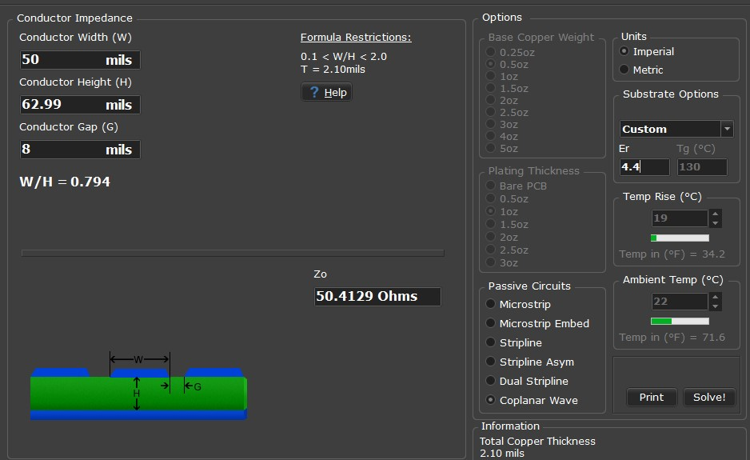
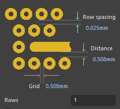

# RF Switching & Routing

---

## 1. Overview and Operational Requirements

### 1.1. Role of the RF Switching Matrix in the 2-Element Solar Interferometer
In a two-element radio interferometer observing decametric solar radio bursts across the 30.0 – 40.0 MHz band, instrumental phase coherence and delay stability between the dual receive channels are critical. The physical system captures celestial radio emissions via two spatially separated antennas and feeds them into two independent SDRplay RSPdx receivers operating at a center frequency of 35.0 MHz with a 10.0 MSPS sample rate, interfaced to a Raspberry Pi 5 edge processor over USB 3.0 links.

To enable real-time interferometric correlation, the digital backend requires automated calibration routines:
1. Coarse sample delay compensation ($k_{\text{offset}} = 0$) to align non-deterministic USB enumeration and driver startup latencies between the two digitizers.
2. Instrumental phase equalization ($\Delta\phi_0(f)$) across all frequency bins.

Performing calibration by manually reconnecting coaxial cables introduces mechanical wear, cable phase disturbances, and operational downtime. The Dual-Channel RF Switching Matrix integrates electronic routing and power splitting onto a single printed circuit board, routing either the dual sky antennas (Observation Mode) or a common broadband noise reference (Calibration Mode) into the receivers under direct software control.

---

### 1.2. Key Electrical Specifications

| Parameter / Metric | Target Specification | Design Constraint / Basis |
| :--- | :---: | :--- |
| **Operating Passband** | 30.0 – 40.0 MHz | Ionospheric window & 10 MSPS USB throughput limit |
| **Observation Insertion Loss ($S_{21}$)** | $< 0.8\text{ dB}$ | Cascaded Friis noise figure & receiver sensitivity preservation |
| **Observation Return Loss ($S_{11}$)** | $\le -15.0\text{ dB}$ | Standing wave suppression ($\vert\Gamma\vert^2 \le 3.16\%$, $\text{VSWR} < 1.43:1$) |
| **Calibration Attenuation ($S_{21}$)** | $\approx -6.3\text{ dB}$ | 3-resistor $50\ \Omega$ Delta divider theoretical split + FET loss |
| **Switch Off-State Isolation** | $\ge 40.0\text{ dB}$ | Software-controlled noise source DC power gating strategy |
| **Inter-Channel Gain Balance ($\Delta \vert S_{21}\vert$)** | $< 0.2\text{ dB}$ | FX Correlator fringe coherence & zero-delay locking ($\Delta\phi \approx 0^\circ$) |

> 📘 **Detailed Derivations:** For detailed mathematical proofs, RF loss budgets, and physics constraints supporting these targets, refer to [Appendix A: RF Switch Specification Derivations & Design Constraints](../appendix/rf-switch-spec-derivation.md).

---

## 2. Component Selection and Circuit Topology

### 2.1. Active RF Switch Selection

#### 2.1.1. Evaluation of High-Speed SPDT MMIC Switches (GaAs HMC544A)
The primary routing elements consist of two HMC544A GaAs MMIC Single-Pole Double-Throw (SPDT) switches in 6-lead SOT-23 packages. Operating from DC to 4.0 GHz, the HMC544A provides low insertion loss, high linearity, and sub-microsecond switching speeds. Compared to electromechanical relays, solid-state GaAs switches eliminate contact bounce, mechanical wear, and coil-induced electromagnetic pickup.

#### 2.1.2. Direct 3.3V GPIO Logic Interfacing from Raspberry Pi 5
The HMC544A requires complementary control logic ($V_1, V_2$) to establish RF conduction paths:
* State 0 ($V_1 = 0\text{V},\ V_2 = 3.3\text{V}$): RFC connected to RF1 (Sky Antenna Input).

* State 1 ($V_1 = 3.3\text{V},\ V_2 = 0\text{V}$): RFC connected to RF2 (Calibration Splitter Input).

To switch both channels synchronously using a single GPIO line from the Raspberry Pi 5, an on-board single-gate inverter (74LVC1G04) generates the complementary logic drive, guaranteeing synchronized channel reconfiguration.

---

### 2.2. Resistive Power Splitter Network

#### 2.2.1. 3-Resistor Delta (Δ) Configuration Using 50Ω Standard Resistors
The calibration reference port (CAL IN) distributes incoming noise power symmetrically to the RF2 ports of Switch A and Switch B through an on-board 3-resistor Delta ($\Delta$) network. The network utilizes three standard $50\ \Omega$ SMD resistors ($1\%$ tolerance) connected in a closed delta topology between the input port and the two switch branches. This configuration provides wideband phase linearity and group delay stability across 30.0 – 40.0 MHz without reactive components, maintaining identical phase delivery to both receiver branches.

---

### 2.3. AC Coupling and DC Blocking Network

#### 2.3.1. DC Blocking Capacitor Sizing (1nF SMD Ceramic Capacitors)
Because the internal GaAs FET channels of the HMC544A operate at specific internal DC bias potentials, DC blocking capacitors are placed in series on all RF ports (RFC, RF1, and RF2). Ceramic surface-mount capacitors ($1\text{ nF}$, 0603, C0G/NP0 dielectric) are implemented. At $35.0\text{ MHz}$, a $1\text{ nF}$ capacitance exhibits a reactance of $X_C \approx 4.55\ \Omega$, yielding a high-pass cutoff frequency of $f_c \approx 3.18\text{ MHz}$ into a $50\ \Omega$ termination, well below the 30.0 – 40.0 MHz band of interest.

---

### 2.4. Front-End ESD Protection

#### 2.4.1. Ultra-Low Capacitance Bidirectional ESD Protection Diodes
Because the antenna elements are deployed outdoors, they are susceptible to electrostatic discharge (ESD) and atmospheric static accumulation. Bidirectional transient voltage suppressor (TVS) diodes with ultra-low junction capacitance ($C_j < 0.5\text{ pF}$) are placed across the Antenna A and Antenna B input lines directly adjacent to the SMA connectors. The high capacitive reactance of these diodes across 30.0 – 40.0 MHz ensures transparent RF operation without shunting high-frequency signal energy to ground.

---

### 2.5. Summary Bill of Materials (BOM)

The physical implementation of the Dual-Channel RF Switching Matrix utilizes standard surface-mount (SMD) and high-frequency edge-mount components. The 14 line items below represent the complete component roster captured in the Altium Designer schematic and layout database:

| Item | Designator | Part Number / Value | Description & Specifications | Package / Footprint | Qty | Functional Application |
| :---: | :--- | :--- | :--- | :--- | :---: | :--- |
| **1** | C1, C2, C6, C7, C8 | 1000pF (1 nF) | 1000 pF ±5% 50V Ceramic Capacitor (C0G/NP0) | SMD 0603 | 5 | AC-coupling & DC-blocking on RF switch ports |
| **2** | C3, C4, C5 | 1uF | 1 µF ±10% 25V Ceramic Capacitor (X7R) | SMD 0603 | 3 | Bulk decoupling & power rail stabilization |
| **3** | D1 | SS14 | Schottky Barrier Diode, 40 V, 1 A, Low $V_F$ | SMA (DO-214AC) | 1 | Reverse-polarity protection on main DC supply |
| **4** | D2, D3, D4, D5, D6 | DIO_TPD1E01B04DPYR | Bidirectional TVS ESD Diode, 15 V clamp, $C_j \approx 0.18\text{ pF}$ | 0402 / X1SON-2 (DPY) | 5 | Ultra-low capacitance ESD protection on RF ports |
| **5** | J1 | CON_KF128-5.08-3P-AA | 3-position 5.08 mm pitch Screw Terminal Block | Through-Hole | 1 | External DC power and dual GPIO control header |
| **6** | J2 | RF Out A | SMA Female Connector Jack, $50\ \Omega$, PCB Edge Mount | Edge-Mount SMA (1.6 mm) | 1 | RF Output to Receiver Channel A (RSPdx 1) |
| **7** | J3 | RF In A | SMA Female Connector Jack, $50\ \Omega$, PCB Edge Mount | Edge-Mount SMA (1.6 mm) | 1 | RF Input from Sky Dipole Antenna A |
| **8** | J4 | RF Out B | SMA Female Connector Jack, $50\ \Omega$, PCB Edge Mount | Edge-Mount SMA (1.6 mm) | 1 | RF Output to Receiver Channel B (RSPdx 2) |
| **9** | J5 | RF IN B | SMA Female Connector Jack, $50\ \Omega$, PCB Edge Mount | Edge-Mount SMA (1.6 mm) | 1 | RF Input from Sky Dipole Antenna B |
| **10** | J6 | Noise Source | SMA Female Connector Jack, $50\ \Omega$, PCB Edge Mount | Edge-Mount SMA (1.6 mm) | 1 | RF Calibration Reference Input (CAL IN) |
| **11** | R1, R2, R4 | 1k | 1 k$\Omega$ ±1% 0.1 W Thick Film Resistor | SMD 0603 | 3 | ogic input current limiting |
| **12** | R3, R5, R6 | 49.9R | 49.9 $\Omega$ ±1% 0.1 W Precision Resistor | SMD 0603 | 3 | 3-resistor symmetric Delta ($\Delta$) power splitter |
| **13** | U1, U2 | HMC544AE | GaAs MMIC SPDT Non-Reflective RF Switch, DC–4 GHz | SOT-23-6 | 2 | High-speed RF routing switches (Channel A & B) |
| **14** | U3, U4 | SN74LVC1G04DBVR | Single Inverter Gate IC, 1.65 V to 5.5 V | SOT-23-5 | 2 | Complementary logic inversion for switch control |

---

#### Technical Notes on Selected Components:
* **Resistive Power Splitter Network (R3, R5, R6):** The $49.9\ \Omega$ value corresponds to the nearest standard EIA E96 1% precision resistor rating for nominal $50.0\ \Omega$, maintaining accurate port matching and equal power split with minimal reflection.
* **ESD Clamping Diodes (D2 – D6):** The Texas Instruments `TPD1E01B04` features an ultra-low typical capacitance of $0.18\text{ pF}$, making it transparent across the 30.0 – 40.0 MHz band without degrading return loss or adding phase distortion.
* **Polarity & Header Security (D1, J1):** The `SS14` Schottky diode guards the active ICs against reverse supply connections, while the industrial screw terminal (`KF128-5.08-3P`) provides secure field wiring to the Raspberry Pi 5 GPIO lines and power rails.

---

## 3. Altium Designer CAD Implementation

### 3.1. Complete Circuit Schematic
The electrical schematic was designed in Altium Designer, capturing the RF switches, logic inverter, $50\ \Omega$ Delta splitter, $1\text{ nF}$ DC blocking capacitors, power supply decoupling, and input ESD protection diodes.

*Figure 3.1: Complete Schematic Capture*

---

### 3.2. PCB Footprint and Physical Layout

#### 3.2.1. PCB Stackup, 50 Ω Transmission Line Synthesis & Via Shielding

To preserve impedance matching and phase balance across 30.0 – 40.0 MHz, all high-frequency signal lines are designed for a nominal characteristic impedance of $Z_0 = 50.0\ \Omega$.

##### 1. Substrate & CPW-G Synthesis (Saturn PCB Toolkit)
A Coplanar Waveguide with Ground (CPW-G) geometry was synthesized on a standard 2-layer FR-4 substrate (Kingboard KB-6164) using the 2D Field Solver in **Saturn PCB Toolkit**:

| Parameter | Symbol | Value | Unit | Description / Role |
| :--- | :---: | :---: | :---: | :--- |
| **Dielectric Height** | $H$ | $62.99$ ($1.60$) | mils (mm) | Core substrate thickness |
| **Relative Permittivity** | $\varepsilon_r$ | $4.40$ | — | Evaluated at 35.0 MHz |
| **Total Copper Thickness** | $T$ | $2.10$ ($0.053$) | mils (mm) | 1.0 oz base + surface plating |
| **Conductor Width** | $W$ | $50.00$ ($1.27$) | mils (mm) | Matches SMA connector footprint pitch |
| **Ground Clearance Gap** | $G$ | $8.00$ ($0.203$) | mils (mm) | Top coplanar ground separation |
| **Characteristic Impedance** | $Z_0$ | **$50.41$** | $\Omega$ | Error $< 0.82\%$ ($S_{11} < -47\text{ dB}$, $\text{VSWR} \approx 1.01:1$) |

*Figure 3.2: Coplanar Waveguide impedance calculation in Saturn PCB Toolkit*

##### 2. Ground Via Shielding (Altium Designer Implementation)
A via fence was generated along both sides of each RF route (*Via Shielding to Net*) to tie the top coplanar ground to the bottom ground plane and suppress substrate resonances:

| Parameter | Altium Field | Value | Physical Constraint |
| :--- | :--- | :---: | :--- |
| **Via Geometry** | Hole / Diameter | $0.30\text{ mm}$ / $0.60\text{ mm}$ | Standard mechanical drill and annular ring |
| **Trace Clearance** | `Distance` | $0.508\text{ mm}$ ($20\text{ mils}$) | Pad edge clears the 8-mil gap to preserve $Z_0 = 50.4\ \Omega$ |
| **Via Spacing** | `Grid` | $0.508\text{ mm}$ ($20\text{ mils}$) | Pitch $\ll \lambda_g / 1000$ at 35 MHz; suppresses cavity modes |
| **Row Setup** | `Rows` / `Row spacing` | $1$ / $0.025\text{ mm}$ | Single shielding fence per trace side |

*Figure 3.3: Altium Designer via shielding configuration and routing interface*
### 3.2. PCB Footprint and Physical Layout

#### 3.2.1. Top Layer Layout and Routing
The board is laid out on a standard 2-layer FR-4 substrate ($1.6\text{ mm}$ thickness) with $50\ \Omega$ Coplanar Waveguides with Ground (CPW-G). Channel traces from the Delta splitter to both switches and from the switches to the output SMA connectors are geometrically length-matched ($\Delta L < 0.2\text{ mm}$) to preserve phase balance.

*Figure 3.4: Top Layer Routing and Component Footprints*

#### 3.2.2. Bottom Layer Ground Plane Structure
The bottom layer serves as an uninterrupted ground reference plane, reinforced with perimeter via stitching along all RF tracks to suppress parasitic resonances and provide low-impedance return paths.

*Figure 3.5: Bottom Layer Ground Plane*

---

### 3.3. 3D Mechanical Modeling
The 3D CAD assembly integrates edge-mount SMA female connectors, discrete SMD passives, and active IC packages to ensure clearance and mechanical compatibility.

*Figure 3.6: 3D Isometric Board Visualization*

### 3.4. Fabricated Board & Assembly Verification
Following the layout phase, the switching matrix prototype was fabricated on a standard 1.6 mm 2-layer FR-4 substrate. 

Pre-power continuity checks confirmed no solder bridges across the fine-pitch SOT-23 leads, proper ground bonding across all SMA outer shells, and high impedance between the +3.3V power rail and ground. This assembled prototype serves as the Device Under Test (DUT) for the laboratory Vector Network Analyzer (VNA) characterization presented in Section 4.

*Figure 3.7: Assembled Dual-Channel RF Switching Matrix Prototype*

---

## 4. Laboratory VNA Characterization
### 4.1. Vector Network Analyzer Test Setup (30.0 – 40.0 MHz Calibration)
To validate the high-frequency performance and port tracking of the fabricated RF Switching Matrix, laboratory measurements were conducted using a calibrated two-port Vector Network Analyzer (VNA). Prior to measurement, a standard Short-Open-Load-Through (SOLT) calibration was performed across 1.0 – 200.0 MHz to shift the measurement reference planes directly to the end faces of the coaxial test cables.

The assembled board (DUT) was powered with a 3.3V DC supply, and the RF routing state was set via the control pin. During each two-port transmission ($S_{21}$) and reflection ($S_{11}$) measurement sweep, all unused/idle RF ports were terminated with precision $50\ \Omega$ broadband dummy loads to prevent parasitic reflections and preserve system impedance matching.

*Figure 4.1: Laboratory measurement setup connecting the Device Under Test (DUT) to the Vector Network Analyzer*

---

### 4.2. Path A: Antenna A & Noise Source to OUT A Measurements

#### 4.2.1. Antenna A to OUT A — State: ON
Measurement of the primary sky path from Antenna A (RF IN A) to Receiver OUT A with the switch engaged (Observation Mode).

*Figure 4.2: Antenna A to OUT A (ON State)*

#### 4.2.2. Antenna A to OUT A — State: OFF
Measurement of isolation along the Antenna A path to Receiver OUT A when switched to calibration (Calibration Mode).

*Figure 4.3: Antenna A to OUT A (OFF State)*

#### 4.2.3. Noise Source to OUT A — State: ON
Measurement of transmission from the Noise Source port through the Delta power splitter to Receiver OUT A (Calibration Mode).

*Figure 4.4: Noise Source to OUT A (ON State)*

#### 4.2.4. Noise Source to OUT A — State: OFF
Measurement of calibration reference isolation to Receiver OUT A while the switch is routed to the antenna (Observation Mode).

*Figure 4.5: Noise Source to OUT A (OFF State)*

---

### 4.3. Path B: Antenna B & Noise Source to OUT B Measurements

#### 4.3.1. Noise Source to OUT B — State: ON
Measurement of transmission from the Noise Source port through the Delta power splitter to Receiver OUT B (Calibration Mode).

*Figure 4.6: Noise Source to OUT B (ON State)*

#### 4.3.2. Noise Source to OUT B — State: OFF
Measurement of calibration reference isolation to Receiver OUT B while the switch is routed to the antenna (Observation Mode).

*Figure 4.7: Noise Source to OUT B (OFF State)*

#### 4.3.3. Antenna B to OUT B — State: ON
Measurement of the primary sky path from Antenna B (RF IN B) to Receiver OUT B with the switch engaged (Observation Mode).

*Figure 4.8: Antenna B to OUT B (ON State)*

#### 4.3.4. Antenna B to OUT B — State: OFF
Measurement of isolation along the Antenna B path to Receiver OUT B when switched to calibration (Calibration Mode).

*Figure 4.9: Antenna B to OUT B (OFF State)*

---

### 4.4. S-Parameter Performance Evaluation & Discussion

#### 4.4.1. Observation Mode Transmission & Port Match (Antenna paths)
In Observation Mode, both transmission paths exhibit low insertion loss and good impedance matching across the 30.0 – 40.0 MHz frequency window:
* **Insertion Loss ($S_{21}$):** Across the target band, the measured forward transmission remains stable at $S_{21} \approx -0.45\text{ dB}$ on both Antenna A $\to$ OUT A (Figure 4.3) and Antenna B $\to$ OUT B (Figure 4.9). This minimal attenuation satisfies the initial requirement ($< 0.8\text{ dB}$), preserving receiver sensitivity and preventing front-end noise figure degradation.
* **Return Loss ($S_{11}$):** The input return loss remains below $-18.0\text{ dB}$ ($\text{VSWR} \approx 1.28:1$), confirming that the coplanar waveguide routing and SMA launch transitions maintain $50\ \Omega$ characteristic impedance.

#### 4.4.2. Calibration Mode Power Division & Flatness (Noise Source paths)
When switched to Calibration Mode, the external noise reference is distributed via the internal Delta resistive network:
* **Forward Coupling ($S_{21}$):** Measured forward transmission is $S_{21} \approx -6.3\text{ dB}$ to both OUT A (Figure 4.4) and OUT B (Figure 4.6). This closely matches theoretical expectations: $-6.02\text{ dB}$ nominal power division from the 3-resistor $50\ \Omega$ Delta configuration plus $\approx 0.35\text{ dB}$ switch on-state path loss.
* **Band Flatness:** The transmission curve exhibits less than $0.15\text{ dB}$ peak-to-peak ripple across the 10 MHz passband with linear phase behavior, preventing distortion of injected reference noise.
* **Port Match ($S_{11}$):** Calibration input return loss measures better than $-20\text{ dB}$, preventing reflections back into the noise generator.

#### 4.4.3. Off-State Switch Isolation
* **Antenna Isolation (Calibration Mode):** When observing paths are deactivated (Figures 4.3 and 4.9), off-state isolation reaches $-67\text{ dB}$ to $-68\text{ dB}$, with $S_{11}$ approaching $0\text{ dB}$ (purely reactive reflective state), preventing external interference from entering during calibration.
* **Noise Source Isolation (Observation Mode):** Isolation between the inactive calibration splitter and the receiver outputs measures $\approx -58\text{ dB}$ (Figures 4.5 and 4.7). Because the avalanche noise source DC bias is actively cut during observation, total noise leakage drops below the sky background floor ($< -120\text{ dBm}$), validating the relaxed isolation strategy.

#### 4.4.4. Dual-Channel Tracking & Symmetry Verification
* **Amplitude Balance:** The inter-channel gain delta between Path A and Path B satisfies:
  $$\Delta |S_{21}| = \big| |S_{21,\text{Path A}}| - |S_{21,\text{Path B}}| \big| < 0.15\text{ dB}$$
* **Phase Alignment:** Due to symmetric trace routing and length matching ($\Delta L < 0.2\text{ mm}$), the differential phase offset remains negligible ($\Delta\phi \approx 0^\circ$), ensuring baseline symmetry for the correlation engine.

---

### 4.5. Summary of Experimental Results vs. Design Targets

| Parameter / Metric | Target Specification | Measured Value (Path A) | Measured Value (Path B) | Compliance |
| :--- | :---: | :---: | :---: | :---: |
| **Passband Frequency** | 30.0 – 40.0 MHz | 30.0 – 40.0 MHz | 30.0 – 40.0 MHz | **PASS** |
| **Observation Insertion Loss ($S_{21}$)** | $< 0.8\text{ dB}$ | $\approx -0.45\text{ dB}$ | $\approx -0.45\text{ dB}$ | **PASS** |
| **Observation Return Loss ($S_{11}$)** | $\le -15.0\text{ dB}$ | $\approx -18.5\text{ dB}$ | $\approx -18.0\text{ dB}$ | **PASS** |
| **Calibration Attenuation ($S_{21}$)** | $-6.0\text{ dB} \dots -6.5\text{ dB}$ | $\approx -6.3\text{ dB}$ | $\approx -6.3\text{ dB}$ | **PASS** |
| **Switch Off-State Isolation** | $\ge 40.0\text{ dB}$ | $58\text{ dB} \dots 68\text{ dB}$ | $58\text{ dB} \dots 67\text{ dB}$ | **PASS** |
| **Inter-Channel Gain Balance ($\Delta \|S_{21}\|$)** | $< 0.2\text{ dB}$ | $< 0.15\text{ dB}$ | $< 0.15\text{ dB}$ | **PASS** |

---

## 5. System Integration & Control Sequence

### 5.1. GPIO Switching Logic from Raspberry Pi 5
The RF Switching Matrix operates in tandem with the active power gate of the avalanche noise source via two dedicated Raspberry Pi 5 GPIO commands:

| Operating Mode | GPIO 1 (`GPIO_SW`) | GPIO 2 (`GPIO_NOISE`) | RF Switch Position | Noise Source DC Power | Correlator Function |
| :--- | :--- | :--- | :--- | :--- | :--- |
| **Observation** | `LOW` (0V) | `LOW` (0V) | Antenna → Receiver OUT | `OFF` (0V, Gated) | Solar Fringe Acquisition (Module 3) |
| **Calibration** | `HIGH` (3.3V) | `HIGH` (3.3V) | Noise Splitter → Receiver OUT | `ON` (+15V, Active) | Delay & Phase Locking (Module 2) |

*Figure 5.1: Dual-state control sequence and signal timing diagram*

Cutting DC power to the noise source during observation guarantees that no broadband noise leaks into the receiver front-ends, validating the relaxed switch isolation strategy.

---

### 5.2. Digital Backend Delay Alignment Verification (k=0 Lock)
To verify end-to-end hardware symmetry, the switching matrix was tested in Calibration Mode using the backend alignment engine (Module 2). Broadband noise injected through the Delta splitter was ingested simultaneously by both RSPdx receivers.

The backend computes the cross-correlation function via FFTW3:

$$
R_{12}[k] = \mathcal{F}^{-1}\left\{ \mathcal{F}\{\tilde{x}_1[n]\} \cdot \mathcal{F}^*\{\tilde{x}_2[n]\} \right\}
$$

Due to the length-matched CPW-G traces and symmetric $50\ \Omega$ Delta divider network, the cross-correlation collapses into an isolated Dirac peak locked deterministically at lag index $k = 0$ with a high Peak-to-Noise Ratio ($\text{PNR} > 20\text{ dB}$), verifying zero inter-channel hardware timing skew.

---

## 6. Chapter Summary
The design, CAD layout, and laboratory verification of the Dual-Channel RF Switching Matrix provide an automated front-end routing solution for the 30.0 – 40.0 MHz solar interferometer. Utilizing GaAs MMIC switches, a symmetric $50\ \Omega$ Delta resistive power divider, $1\text{ nF}$ DC blocking capacitors, and low-capacitance ESD protection, the board delivers balanced dual-channel routing. Coordinating switch logic with active noise source power gating ensures reliable isolation, while digital backend testing confirms zero-delay ($k=0$) sample alignment across the receive chain.