# RF Switching & Routing

---

## 1. Overview and Operational Requirements

### 1.1. Role of the RF Switching Matrix in the 2-Element Solar Interferometer
In a two-element radio interferometer observing decametric solar radio bursts across the 30.0 – 40.0 MHz band, instrumental phase coherence and delay stability between the dual receive channels are critical. The physical system captures celestial radio emissions via two spatially separated antennas and feeds them into two independent SDRplay RSPdx receivers operating at a center frequency of 35.0 MHz with a 10.0 MSPS sample rate, interfaced to a Raspberry Pi 5 edge processor over USB 3.0 links.
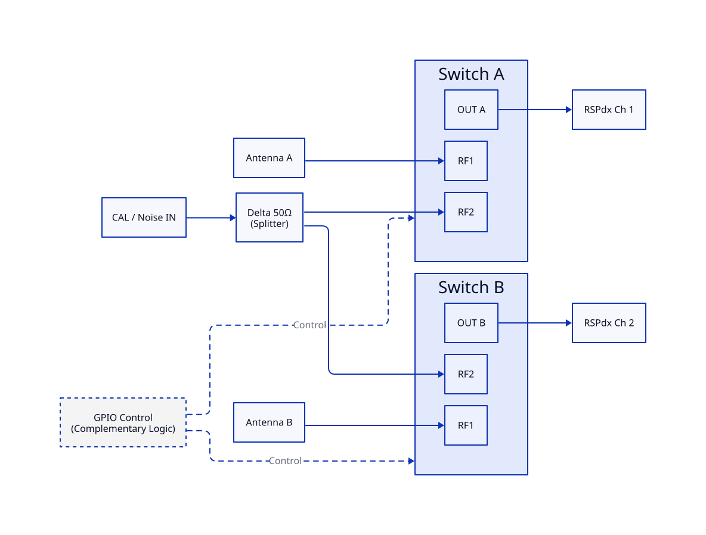

To enable real-time interferometric correlation, the digital backend requires automated calibration routines:
1. Coarse sample delay compensation ($k_{\text{offset}} = 0$) to align non-deterministic USB enumeration and driver startup latencies between the two digitizers.
2. Instrumental phase equalization ($\Delta\phi_0(f)$) across all frequency bins.

Performing calibration by manually reconnecting coaxial cables introduces mechanical wear, cable phase disturbances, and operational downtime. The Dual-Channel RF Switching Matrix integrates electronic routing and power splitting onto a single printed circuit board, routing either the dual sky antennas (Observation Mode) or a common broadband noise reference (Calibration Mode) into the receivers under direct software control.

---

### 1.2. Key Electrical and System Specifications (30.0 – 40.0 MHz)

#### 1.2.1. System Characteristic Impedance (50Ω)
All input and output ports, coplanar waveguide transmission lines, and the integrated calibration splitter network are designed for a standard $50\ \Omega$ characteristic impedance ($Z_0 = 50\ \Omega$) to match the antennas, coaxial feeds, and RSPdx Port C BNC inputs.

#### 1.2.2. Insertion Loss and Signal Integrity Targets
Because celestial radio emissions received at the antenna terminals are faint, insertion loss along the primary antenna path must remain minimal ($< 0.8\text{ dB}$) across the 30.0 – 40.0 MHz passband. Minimizing front-end attenuation preserves the overall system noise figure ($NF$) and sensitivity.

#### 1.2.3. Dual-Channel Phase and Amplitude Tracking Requirements
Correlator performance depends on structural balance between Channel A and Channel B. The switching matrix requires matched insertion loss ($\Delta \vert{}S_{21}\vert{} < 0.2\text{ dB}$) and near-zero differential phase offset ($\Delta\phi \approx 0^\circ$) between both channels to ensure that phase measurements originate strictly from astronomical baseline geometry or coronal burst phenomena.

#### 1.2.4. Isolation Strategy: Switch Isolation Optimization via GPIO-Controlled Noise Source Power Gating
Standard RF switching topologies often demand high isolation ($> 60\text{ dB}$) to prevent active calibration signals from leaking into the receive path during sensitive sky observations. In this architecture, isolation constraints on the RF switch ICs are relaxed because the external broadband avalanche noise source is equipped with an active DC power gate controlled by the Raspberry Pi 5 GPIO.

When the system operates in Observation Mode (Antenna $\to$ OUT), the host software commands the high-side switch to cut DC power to the noise generator. Devoid of DC bias, avalanche noise generation ceases entirely, dropping the source output to its passive thermal noise floor. Consequently, moderate switch isolation is sufficient to prevent spurious baseline contamination, eliminating the need for complex, multi-stage cascaded RF switches.

---

## 2. Component Selection and Circuit Topology

### 2.1. Active RF Switch Selection

#### 2.1.1. Evaluation of High-Speed SPDT MMIC Switches (GaAs HMC544A)
The primary routing elements consist of two HMC544A GaAs MMIC Single-Pole Double-Throw (SPDT) switches in 6-lead SOT-23 packages. Operating from DC to 4.0 GHz, the HMC544A provides low insertion loss, high linearity, and sub-microsecond switching speeds. Compared to electromechanical relays, solid-state GaAs switches eliminate contact bounce, mechanical wear, and coil-induced electromagnetic pickup.

#### 2.1.2. Direct 3.3V GPIO Logic Interfacing from Raspberry Pi 5
The HMC544A requires complementary control logic ($V_1, V_2$) to establish RF conduction paths:
* State 0 ($V_1 = 0\text{V},\ V_2 = 3.3\text{V}$): RFC connected to RF1 (Sky Antenna Input).

* State 1 ($V_1 = 3.3\text{V},\ V_2 = 0\text{V}$): RFC connected to RF2 (Calibration Splitter Input).

To switch both channels synchronously using a single GPIO line from the Raspberry Pi 5, an on-board single-gate inverter (74LVC1G04) generates the complementary logic drive, guaranteeing synchronized channel reconfiguration.

---

### 2.2. Resistive Power Splitter Network

#### 2.2.1. 3-Resistor Delta (Δ) Configuration Using 50Ω Standard Resistors
The calibration reference port (CAL IN) distributes incoming noise power symmetrically to the RF2 ports of Switch A and Switch B through an on-board 3-resistor Delta ($\Delta$) network. The network utilizes three standard $50\ \Omega$ SMD resistors ($1\%$ tolerance) connected in a closed delta topology between the input port and the two switch branches. This configuration provides wideband phase linearity and group delay stability across 30.0 – 40.0 MHz without reactive components, maintaining identical phase delivery to both receiver branches.

---

### 2.3. AC Coupling and DC Blocking Network

#### 2.3.1. DC Blocking Capacitor Sizing (1nF SMD Ceramic Capacitors)
Because the internal GaAs FET channels of the HMC544A operate at specific internal DC bias potentials, DC blocking capacitors are placed in series on all RF ports (RFC, RF1, and RF2). Ceramic surface-mount capacitors ($1\text{ nF}$, 0603, C0G/NP0 dielectric) are implemented. At $35.0\text{ MHz}$, a $1\text{ nF}$ capacitance exhibits a reactance of $X_C \approx 4.55\ \Omega$, yielding a high-pass cutoff frequency of $f_c \approx 3.18\text{ MHz}$ into a $50\ \Omega$ termination, well below the 30.0 – 40.0 MHz band of interest.

---

### 2.4. Front-End ESD Protection

#### 2.4.1. Ultra-Low Capacitance Bidirectional ESD Protection Diodes
Because the antenna elements are deployed outdoors, they are susceptible to electrostatic discharge (ESD) and atmospheric static accumulation. Bidirectional transient voltage suppressor (TVS) diodes with ultra-low junction capacitance ($C_j < 0.5\text{ pF}$) are placed across the Antenna A and Antenna B input lines directly adjacent to the SMA connectors. The high capacitive reactance of these diodes across 30.0 – 40.0 MHz ensures transparent RF operation without shunting high-frequency signal energy to ground.

---

## 3. Altium Designer CAD Implementation

### 3.1. Complete Circuit Schematic
The electrical schematic was designed in Altium Designer, capturing the RF switches, logic inverter, $50\ \Omega$ Delta splitter, $1\text{ nF}$ DC blocking capacitors, power supply decoupling, and input ESD protection diodes.

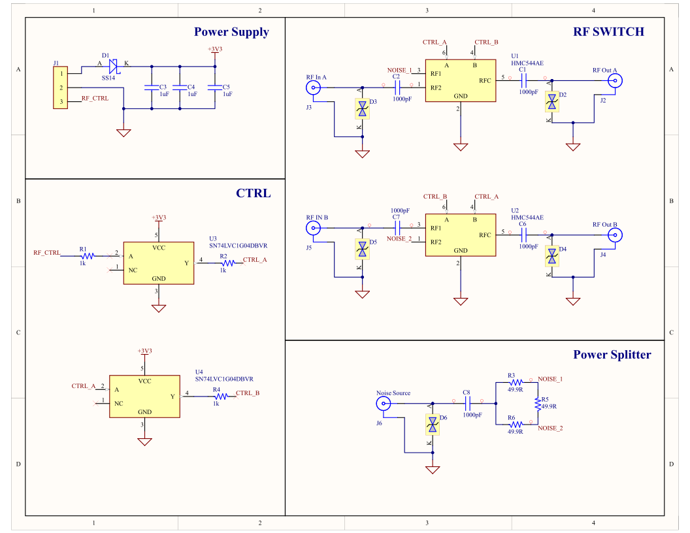
*Figure 3.1: Complete Schematic Capture*

---

### 3.2. PCB Footprint and Physical Layout

#### 3.2.1. Top Layer Layout and Routing
The board is laid out on a standard 2-layer FR-4 substrate ($1.6\text{ mm}$ thickness) with $50\ \Omega$ Coplanar Waveguides with Ground (CPW-G). Channel traces from the Delta splitter to both switches and from the switches to the output SMA connectors are geometrically length-matched ($\Delta L < 0.2\text{ mm}$) to preserve phase balance.

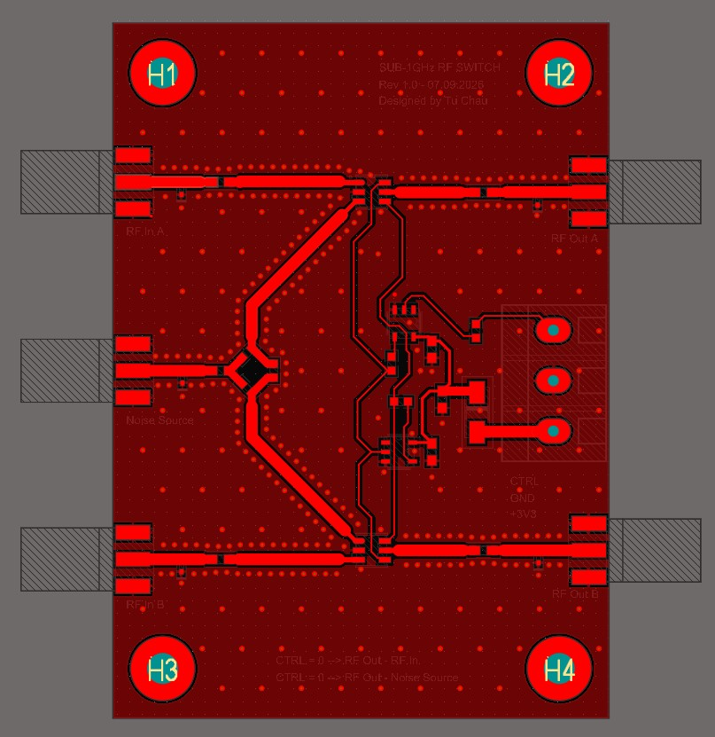
*Figure 3.2: Top Layer Routing and Component Footprints*

#### 3.2.2. Bottom Layer Ground Plane Structure
The bottom layer serves as an uninterrupted ground reference plane, reinforced with perimeter via stitching along all RF tracks to suppress parasitic resonances and provide low-impedance return paths.

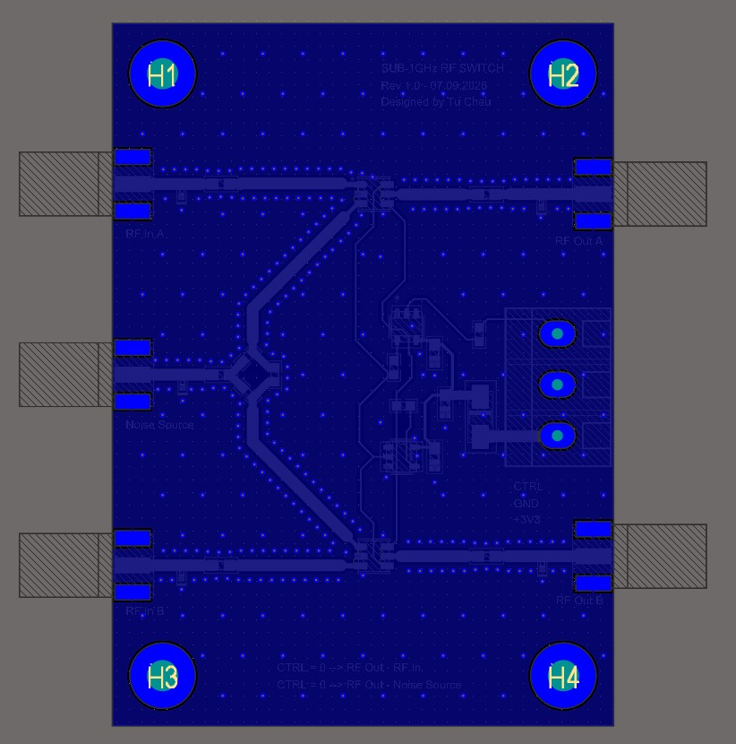
*Figure 3.3: Bottom Layer Ground Plane*

---

### 3.3. 3D Mechanical Modeling
The 3D CAD assembly integrates edge-mount SMA female connectors, discrete SMD passives, and active IC packages to ensure clearance and mechanical compatibility.

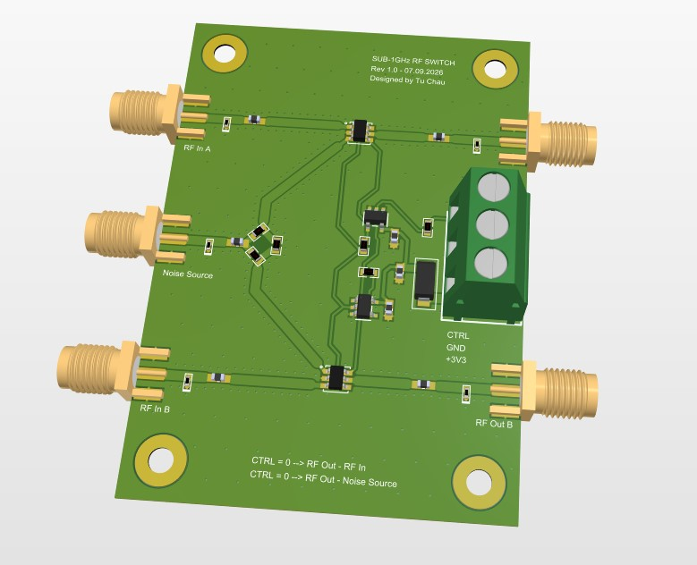
*Figure 3.4: 3D Isometric Board Visualization*

### 3.4. Fabricated Board & Assembly Verification
Following the layout phase, the switching matrix prototype was fabricated on a standard 1.6 mm 2-layer FR-4 substrate. 

Pre-power continuity checks confirmed no solder bridges across the fine-pitch SOT-23 leads, proper ground bonding across all SMA outer shells, and high impedance between the +3.3V power rail and ground. This assembled prototype serves as the Device Under Test (DUT) for the laboratory Vector Network Analyzer (VNA) characterization presented in Section 4.
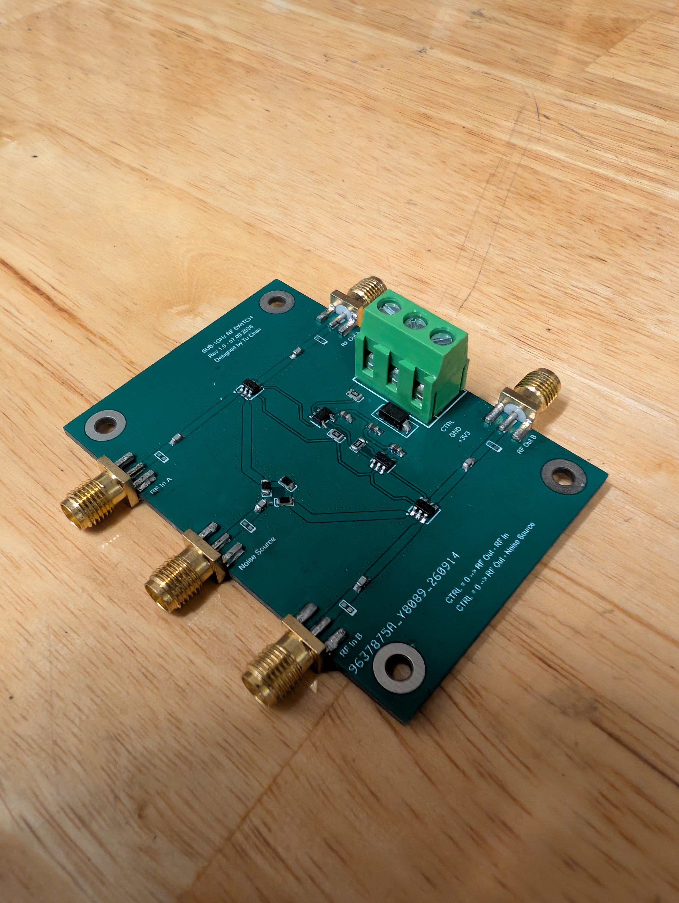
*Figure 3.5: Assembled Dual-Channel RF Switching Matrix Prototype*

---

## 4. Laboratory VNA Characterization

### 4.1. Vector Network Analyzer Test Setup (30.0 – 40.0 MHz Calibration)
High-frequency S-parameter characterization was performed using a two-port Vector Network Analyzer calibrated via a standard Short-Open-Load-Through (SOLT) procedure across 1.0 – 100.0 MHz, with observational markers evaluated across the 30.0 – 40.0 MHz passband.

---

### 4.2. Channel A Transmission & S-Parameter Measurements
To validate the high-frequency performance and inter-channel tracking of the fabricated RF Switching Matrix, laboratory measurements were conducted using a calibrated two-port Vector Network Analyzer (VNA). Prior to measurement, a standard Short-Open-Load-Through (SOLT) calibration was performed across 1.0 – 200.0 MHz to shift the measurement reference planes directly to the ends of the test cables.

The assembled board (DUT) was powered with a 3.3V DC supply, and the logic state was set via the control pin. During each two-port transmission ($S_{21}$) and reflection ($S_{11}$) measurement, all idle RF ports were terminated with precision $50\ \Omega$ broadband dummy loads to prevent parasitic reflections and preserve impedance matching.

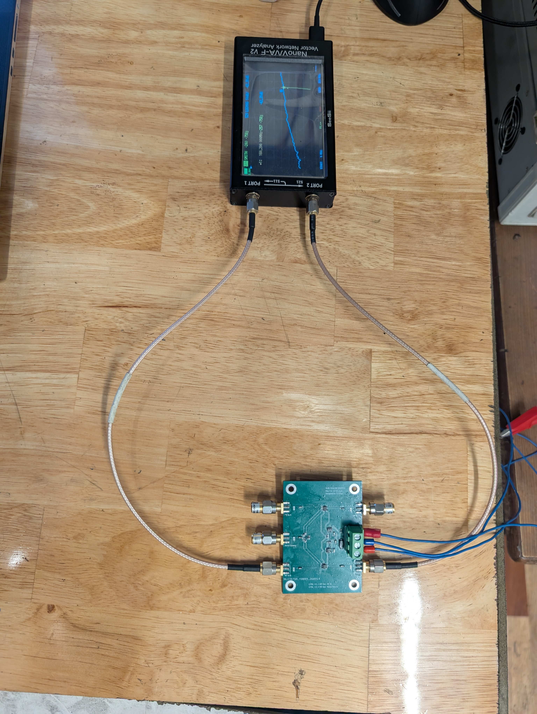
*Figure 4.1: Laboratory measurement setup connecting the Device Under Test (DUT) to the Vector Network Analyzer*
#### 4.2.1. Antenna IN to Receiver OUT — State: ON
Measurement of Channel A with the antenna path engaged (Observation Mode).

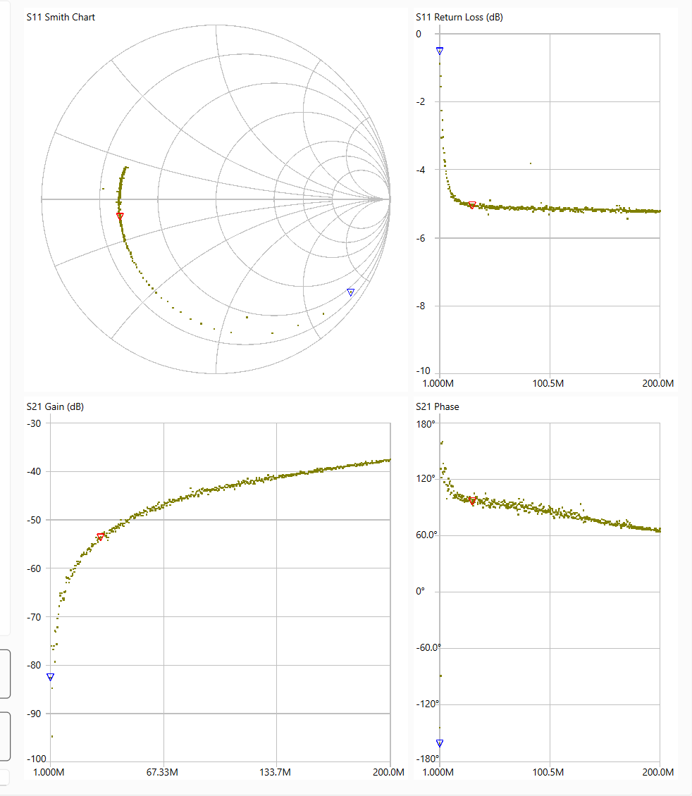
*Figure 4.2: Channel A IN to OUT (ON State)*

#### 4.2.2. Antenna IN to Receiver OUT — State: OFF
Measurement of Channel A with the antenna path isolated (Calibration Mode).

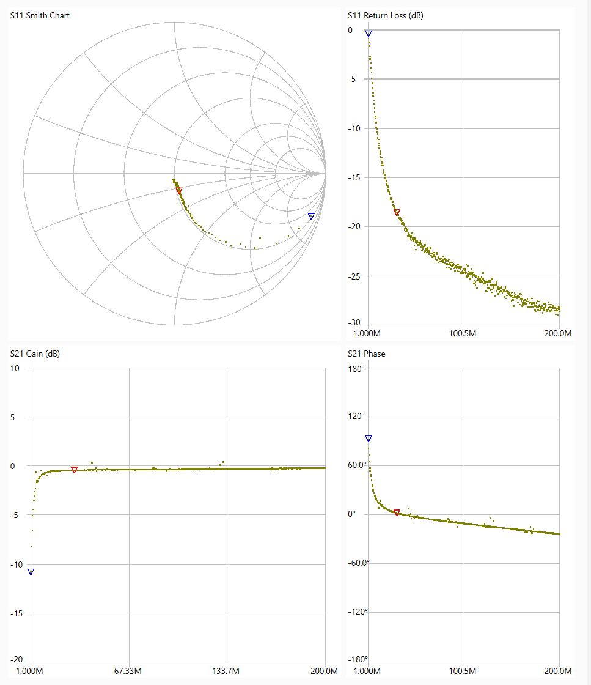
*Figure 4.3: Channel A IN to OUT (OFF State)*

#### 4.2.3. Noise Source IN to Receiver OUT — State: ON
Measurement of Channel A through the Delta power splitter with the calibration path engaged (Calibration Mode).

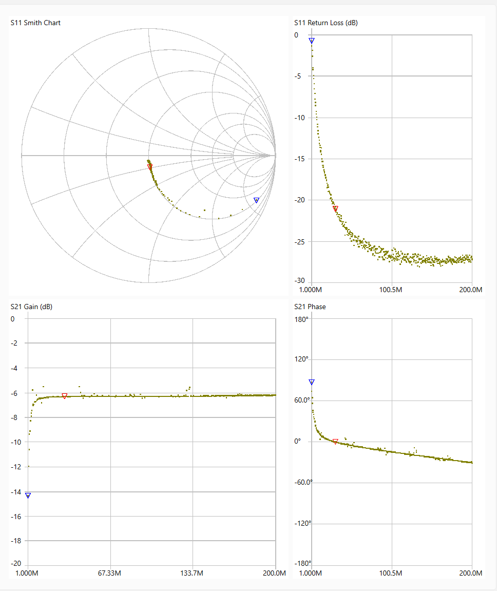
*Figure 4.4: Channel A Noise Source to OUT (ON State)*

#### 4.2.4. Noise Source IN to Receiver OUT — State: OFF
Measurement of Channel A calibration port isolation with the switch routed to the antenna (Observation Mode).

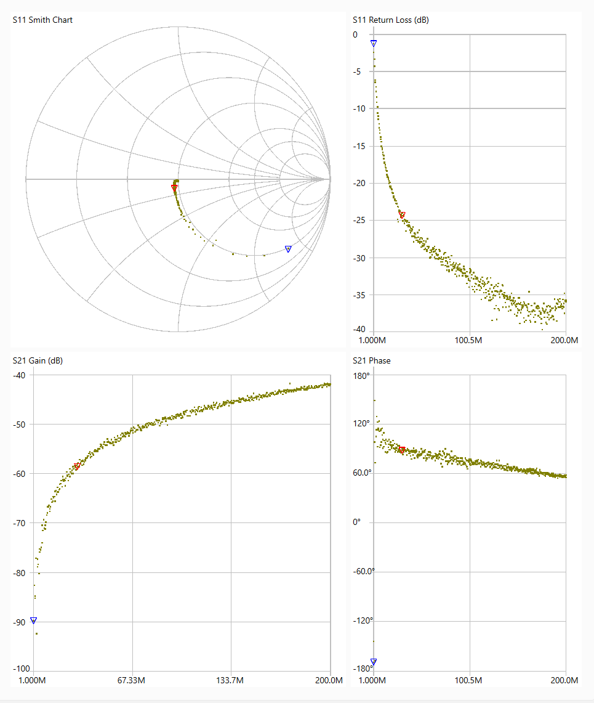
*Figure 4.5: Channel A Noise Source to OUT (OFF State)*

---

### 4.3. Channel B Transmission & S-Parameter Measurements

#### 4.3.1. Noise Source IN to Receiver OUT — State: ON
Measurement of Channel B through the Delta power splitter with the calibration path engaged (Calibration Mode).

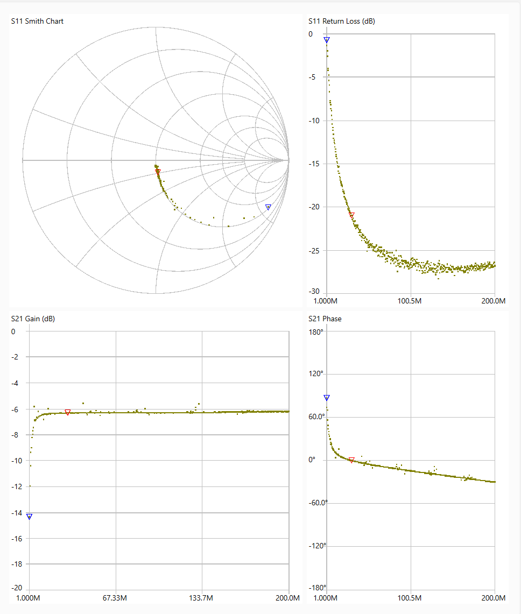
*Figure 4.6: Channel B Noise Source to OUT (ON State)*

#### 4.3.2. Noise Source IN to Receiver OUT — State: OFF
Measurement of Channel B calibration port isolation with the switch routed to the antenna (Observation Mode).

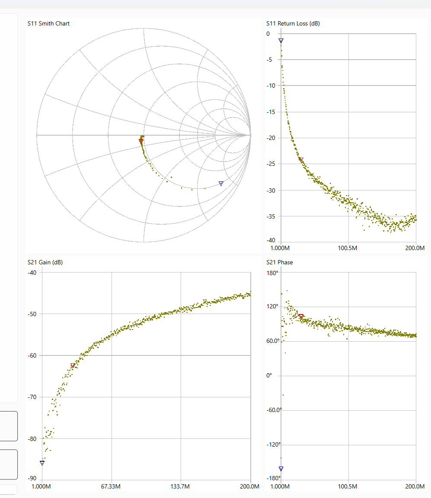
*Figure 4.7: Channel B Noise Source to OUT (OFF State)*

#### 4.3.3. Antenna IN to Receiver OUT — State: ON
Measurement of Channel B with the antenna path engaged (Observation Mode).

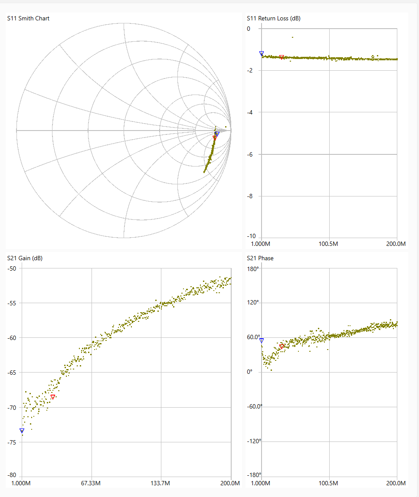
*Figure 4.8: Channel B IN to OUT (ON State)*

#### 4.3.4. Antenna IN to Receiver OUT — State: OFF
Measurement of Channel B with the antenna path isolated (Calibration Mode).

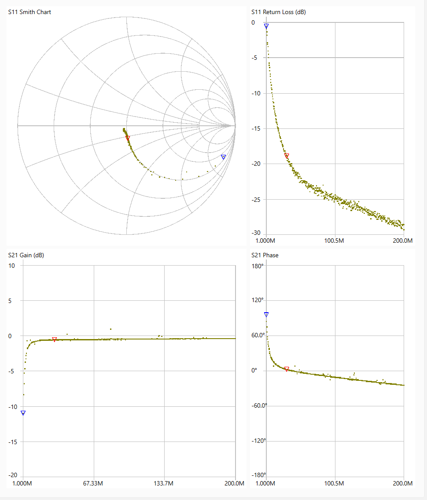
*Figure 4.9: Channel B IN to OUT (OFF State)*

---
## 5. System Integration & Control Sequence

### 5.1. GPIO Switching Logic from Raspberry Pi 5
The RF Switching Matrix operates in tandem with the active power gate of the avalanche noise source via two dedicated Raspberry Pi 5 GPIO commands:

| Operating Mode | GPIO 1 (`GPIO_SW`) | GPIO 2 (`GPIO_NOISE`) | RF Switch Position | Noise Source DC Power | Correlator Function |
| :--- | :--- | :--- | :--- | :--- | :--- |
| **Observation** | `LOW` (0V) | `LOW` (0V) | Antenna → Receiver OUT | `OFF` (0V, Gated) | Solar Fringe Acquisition (Module 3) |
| **Calibration** | `HIGH` (3.3V) | `HIGH` (3.3V) | Noise Splitter → Receiver OUT | `ON` (+15V, Active) | Delay & Phase Locking (Module 2) |

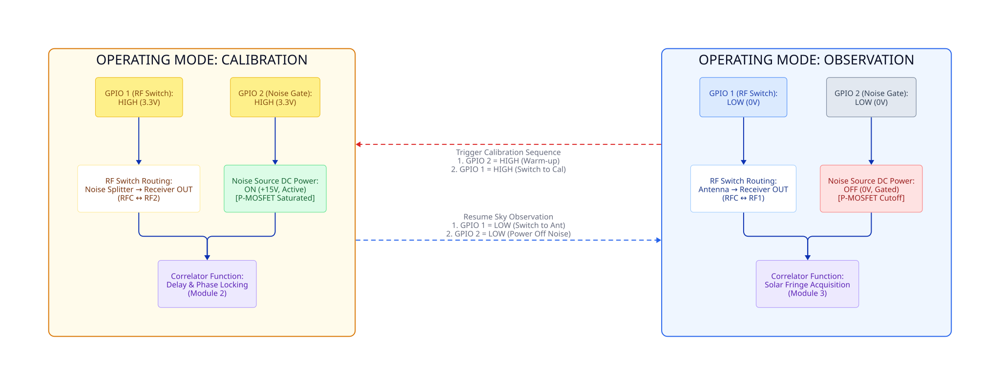
*Figure 5.1: Dual-state control sequence and signal timing diagram*

Cutting DC power to the noise source during observation guarantees that no broadband noise leaks into the receiver front-ends, validating the relaxed switch isolation strategy.

---

### 5.2. Digital Backend Delay Alignment Verification ($k=0$ Lock)
To verify end-to-end hardware symmetry, the switching matrix was tested in Calibration Mode using the backend alignment engine (Module 2). Broadband noise injected through the Delta splitter was ingested simultaneously by both RSPdx receivers.

The backend computes the cross-correlation function via FFTW3:

$$
R_{12}[k] = \mathcal{F}^{-1}\left\{ \mathcal{F}\{\tilde{x}_1[n]\} \cdot \mathcal{F}^*\{\tilde{x}_2[n]\} \right\}
$$

Due to the length-matched CPW-G traces and symmetric $50\ \Omega$ Delta divider network, the cross-correlation collapses into an isolated Dirac peak locked deterministically at lag index $k = 0$ with a high Peak-to-Noise Ratio ($\text{PNR} > 20\text{ dB}$), verifying zero inter-channel hardware timing skew.

---

## 6. Chapter Summary
The design, CAD layout, and laboratory verification of the Dual-Channel RF Switching Matrix provide an automated front-end routing solution for the 30.0 – 40.0 MHz solar interferometer. Utilizing GaAs MMIC switches, a symmetric $50\ \Omega$ Delta resistive power divider, $1\text{ nF}$ DC blocking capacitors, and low-capacitance ESD protection, the board delivers balanced dual-channel routing. Coordinating switch logic with active noise source power gating ensures reliable isolation, while digital backend testing confirms zero-delay ($k=0$) sample alignment across the receive chain.